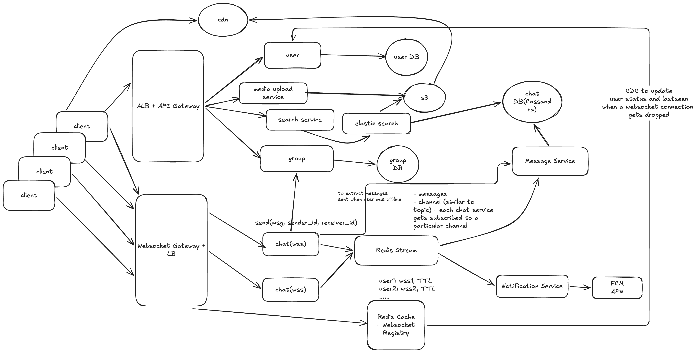

# Design a chat-app like whatsapp

## functional requirements

- User should be able to signup/login
- 1:1 messaging
- group messaging
- support text and media as message
- message history
- delivery/read receipts

## non functional requirements

- scale: 1B users, 100msgs/day/user i.e 100B messages/day (1kb \* 100B = 100TB/day)
- low latency < 300ms
- CAP theorem: highly available and eventually consistent
- high reliability with zero message loss

## Core Entity

- Group
- User
- Message/Chat

## API creation

### User ops

- POST /v1/user/register -> body: {user_name, phone/email, ...}
- POST /v1/user/login -> res: JWT

### 1:1Messaging

- WS(websocket): /v1/messages/send
- GET /v1/chat/{user_id} -> Paginated list of chats
- GET /v1/message/{user_id}/{receiver_id}: Lazy load

### Group Messaging

- POST /v1/groups/create
- POST /v1/groups/{group_id}
- POST /v1/groups/{group_id}/remove
- WS: /v1/messages/send
- GET /v1/groups/{group_id}/message: Lazy load

## Deep Dive

### Choice of DB

- User DB (Postgres)
  - User Table: (id, user_name, phone, status, last_seen, ...metadata)
- Group DB (Postgres)
  - Group Table: (id, name, description,...metadata )
  - UserGroupMap: (id, group_id, user_id, joined_date, ...metadata)
- Chat DB(Cassandra):
  - Chat Table: chat_id, message_id, message_id, sender_id, receiver_id, message, type(text/image), timestamp, delivery_status



## functionality of redis stream

- each websocket server/connector is subscribed to a redis stream `channel`
- consider channels similar to SNS or Kafka topics
- each channel can store messages for a particular ws connector
- any message coming from a ws connector is passed to redis stream
- the ws connector which is subscribed to the redis stream channel gets the message

## User flow

- once user comes to whatsapp, we register the user using `User` service

### onboarding offline user

- once user logs in, request comes to backend service which checks if the user is present in the websocket Redis registry
  - if user is present, we return the active websocketconnector for that user
  - if not, there's no active websocketconnector -> the http request gets converted to a websocket connector and an entry for the same gets inserted into our websocket registry
- check whether undelivered message is present for the user or not
  - request goes to `Chat` services -> which internally calls `Message` service -> reaches out to `Redis Stream` (fallback present in `ChatDB`) to retrieve all undelivered message (based on `reciever_id == user_id` and `delivery_status == 'MESSAGE_SENT'`) -> return message via wsconnector to user
  - once user1 receives message, the client sends acknowledgement (`MESSAGE_DELIVERED`) to update the `delivery_status` (double tick)
  - similarly when user opens and reads a message, andother ack from client (`MESSAGE_READ`) via ws conector into the chat service to update `delivery_status` (blue tick)

All of this data flow happens via the redis stream

### 1:1 message

user 1 -> user 2

- user 1 sends messaage via websocket
- chat service checks user 2 is online and get it's wsconnector
- message gets send to user2 ws connector immediately
- message gets sent to cassandra(chatDB) to persist
- ack that user 2 has read the message

## group message

- we mention group_id
- chat service calls group service to fetch user_id for the group
- check availability for the users using the WS registry
- for available users, message immediately gets sent via WS connector
- for offline users, message gets persisted to cassandra via Redis Stream and message service

## Deep Dive (walkthrough)

### 0. The 30-second pitch

> "Clients hold a persistent **WebSocket** to a fleet of stateless **chat (WSS) servers** behind a WebSocket gateway. A **Redis websocket registry** maps each online user to the server holding their connection, with a **TTL** refreshed by heartbeats. Servers talk to each other through **Redis Streams**: each chat server subscribes to its own channel, so a message for user2 is published to user2's server's channel. Every message is **persisted to Cassandra first** (partitioned by chat_id) through the **Message Service**, then delivered, then acknowledged back as **sent → delivered → read** ticks. Offline users get a push via **FCM/APNs** and pull undelivered messages when they reconnect. Media goes to **S3 behind a CDN**, and only its URL travels in the message. Search runs on **Elasticsearch**. The system favours **availability and eventual consistency**, with **zero message loss** from persist-before-deliver and client retries with idempotency keys."

---

### 1. Flow 1: Signup and login

`POST /v1/user/register`, `POST /v1/user/login → JWT`

```
Client → ALB + API Gateway → User Service → User DB (Postgres)
                                          ← JWT
```

- **Key point:** the JWT is later sent on the WebSocket handshake, so the WS gateway can authenticate the connection without calling the User Service on every message.
- **User table:** id, user_name, phone, status, last_seen, ...metadata
- **Why Postgres?** User data is small, relational and needs unique constraints (phone/email). It is read-heavy, so add read replicas and a cache.

---

### 2. Flow 2: Connecting and presence (WebSocket registry)

`WS /v1/messages/send` (connection opened after login)

```
Client ──(WS + JWT)──→ WebSocket Gateway + LB → chat(wss) server N
                                               ├─→ Redis Cache (WS Registry): user1 → wss1, TTL
                                               ├─→ subscribe to Redis Stream channel "wss1"
                                               └─→ fetch undelivered messages (Flow 4)
Client ──(heartbeat every ~30s)──→ refreshes the TTL
Connection drops / TTL expires → registry entry removed
                               → event → User Service → User DB: status = offline, last_seen = now
```

- **Why WebSockets?** Messages must reach the receiver in under 300ms, and the server has to push. Polling 1B users would waste huge bandwidth. A persistent connection gives two-way, low-latency delivery.
- **Why a TTL on the registry?** If a server crashes, it can't clean up its entries. The TTL makes stale entries expire on their own, so we don't route messages to a dead server for long.
- **Presence update:** the diagram labels this "CDC". In practice it is the disconnect event (or a Redis keyspace-expiry event) that updates `status` and `last_seen`. It is asynchronous, so last-seen is eventually consistent, which is fine.
- **Scale:** at ~1B users with, say, 20% online and ~50K–100K connections per server, you need a few thousand chat servers. The servers are stateless apart from their sockets, so they scale horizontally.

---

### 3. Flow 3: 1:1 message (the core deep dive)

`WS send(msg, sender_id, receiver_id, client_msg_id)`

```
user1 → wss1 (chat server)
  1. Validate, assign message_id (time-ordered, e.g. Snowflake / TimeUUID)
  2. Write to Redis Stream → Message Service → Chat DB (Cassandra)   status = SENT
  3. ACK to user1 (single tick) once the write is durable
  4. Look up user2 in the WS Registry
        ├─ ONLINE on wss2 → publish to Redis Stream channel "wss2"
        │                   → wss2 pushes to user2
        │                   → user2 client ACKs → status = DELIVERED (double tick) → pushed back to user1
        │                   → user2 opens chat  → status = READ (blue tick)      → pushed back to user1
        └─ OFFLINE        → Notification Service → FCM / APNs push
                            (message waits in Chat DB until user2 reconnects, Flow 4)
```

#### Chat DB (Cassandra)

- **Message table:** chat_id (partition key), message_id (clustering key, time-ordered), sender_id, receiver_id, message, type (text/image/video), media_url, timestamp, delivery_status
- **chat_id** for 1:1 is derived deterministically, e.g. `hash(min(user_a, user_b), max(user_a, user_b))`, so both sides hit the same partition.
- **Why Cassandra?** 100B messages/day (~1M+ writes/sec, ~100TB/day). It is write-optimised (LSM tree), scales linearly, has no single master and is tunable toward availability. The access pattern is simple: "latest N messages of a chat", which is exactly one partition read in clustering order.
- **Why partition by chat_id?** All messages of a conversation live together and come back already sorted. To avoid huge partitions for very old or very busy chats, bucket by time: `(chat_id, month)`.
- **Retention:** use a TTL or tiered storage (like WhatsApp, which deletes after delivery) to control the ~100TB/day growth.

#### Why persist first, then deliver?

The README's note sends to user2 first and then persists. For **zero message loss**, flip it: persist (or at least get it into the durable stream) before sending the ACK to user1. If wss2 or user2's network dies mid-delivery, the message is still in the DB as SENT and is redelivered on reconnect.

#### The consistency problems (very common interview questions)

- **Problem 1: duplicates.** user1 sends, the ACK is lost, and the client retries. Without care, user2 sees the message twice.
  - **Solution:** the client attaches a `client_msg_id` (idempotency key). The server dedupes on `(chat_id, client_msg_id)`, and the receiving client also dedupes by message_id. Delivery is **at-least-once**, and the dedupe makes it effectively exactly-once to the user.
- **Problem 2: ordering.** Two messages sent quickly may go through different servers and arrive out of order.
  - **Solution:** order by a **per-chat, time-ordered message_id** (Snowflake or a per-chat sequence), not by arrival time. The client sorts by it on insert.
- **Problem 3: stale registry / reconnect race.** user2 drops from wss2 and reconnects to wss3 while a message is on its way to wss2.
  - **Solution:** wss2 fails to push, so there is no DELIVERED ack. The message stays SENT in the DB, and user2's reconnect on wss3 pulls it (Flow 4). The registry update on reconnect overwrites the old entry, so new messages go to wss3.

#### CAP mapping (say this explicitly)

- **Availability over consistency:** a user must always be able to send, even during a partition. Cassandra with a quorum or `LOCAL_QUORUM` write gives durability without a single master.
- **Eventual consistency is acceptable** for ticks, last seen and message history on a second device. A tick appearing a second late is fine; a lost message is not, which is why durability is the one thing we never trade away.

---

### 4. Flow 4: Offline user comes online (sync + receipts)

`GET /v1/chat/{user_id}`, `GET /v1/message/{user_id}/{receiver_id}` (lazy load)

```
user2 reconnects → wss3 → registry: user2 → wss3, TTL
   → Message Service → Redis Stream (recent) / Chat DB (fallback)
        WHERE receiver_id = user2 AND delivery_status = SENT
   → pushed to user2 over WS
   → user2 ACKs → DELIVERED → sender notified (double tick)
   → user2 reads → READ    → sender notified (blue tick)
Scroll up → paginated GET (cursor = last message_id) → Chat DB
```

- **Key point:** querying Cassandra by `receiver_id + status` is not a partition-key lookup. Keep a separate **inbox / undelivered table** partitioned by `receiver_id` (written alongside the message and cleared on DELIVERED), or use a per-device "last synced message_id" cursor per chat.
- **Why cursor pagination?** Offsets on a huge chat are slow and shift as new messages arrive. `message_id < cursor LIMIT 50` is a single ordered partition scan.
- **Receipts are just small messages** travelling the same path (WS → Redis Stream → sender's server), so no extra infrastructure is needed.

---

### 5. Flow 5: Group message

`POST /v1/groups/create`, `POST /v1/groups/{group_id}`, `POST /v1/groups/{group_id}/remove`, `WS send(msg, sender_id, group_id)`

```
user1 → wss1 → persist once to Chat DB (chat_id = group_id)
            → Group Service → Group DB: members of group_id (cached in Redis)
            → WS Registry lookup for every member
                 ├─ online  → group by server → one publish per server channel (wss2, wss5, ...)
                 │            → each server pushes to its local members
                 └─ offline → Notification Service → FCM / APNs
```

- **Group table:** id, name, description, ...metadata
- **UserGroupMap:** id, group_id, user_id, joined_date, role (admin/member), ...metadata
- **Why Postgres for groups?** Membership changes are low-volume and need consistency (add/remove, admin rights). Cache the member list in Redis, since it's read on every message.
- **Key point: store once, fan out on delivery.** The message is written once per group, not once per member. Only the delivery fans out.
- **Receipts in groups:** keep per-member status separately (`group_id, message_id, user_id, status`); "blue tick" means all members have read it.
- **Cap group size** (WhatsApp caps at ~1K). Very large groups or channels switch to a pull model, where clients fetch instead of the server pushing to everyone.

---

### 6. Flow 6: Media messages

```
Client → API GW → Media Upload Service → pre-signed URL
Client ──(upload directly)──→ S3
Client → WS send(type = image, media_url, thumbnail) → normal message flow (Flow 3)
Receiver → CDN (backed by S3) → downloads media
```

- **Why pre-signed URLs?** Large files don't pass through the chat servers. The WebSocket carries only a small message with the URL.
- **Why a CDN?** The same media (especially in groups and forwards) is fetched many times, from all over the world. The CDN caches it near users.
- **Dedupe:** content-hash the file so forwarding a popular video doesn't store it again.

---

### 7. Flow 7: Search

```
Client → API GW → Search Service → Elasticsearch
Chat DB (Cassandra) ──(CDC / async indexer)──→ Elasticsearch
```

- **Why Elasticsearch?** Cassandra can't do full-text search. ES builds an inverted index over message text, user names and group names.
- **Key point:** indexing is asynchronous, so a brand-new message may take a second to become searchable. That fits the eventual-consistency requirement. Index only metadata (file name, sender) for media, not the S3 object itself.
- **Scope searches by user:** filter on the chats a user belongs to, so no one can search other people's messages.

---

### Data stores at a glance

| Store | Tech | Holds | Why |
|---|---|---|---|
| User DB | Postgres | Users, status, last_seen | Relational, unique constraints, read-heavy |
| Group DB | Postgres | Groups, UserGroupMap | Consistent membership changes, low volume |
| Chat DB | Cassandra | Messages, delivery status | ~1M+ writes/sec, linear scale, AP, partition by chat_id |
| WS Registry | Redis (with TTL) | user_id → chat server | Very fast lookups, self-cleaning on crash |
| Redis Stream | Redis Streams | Per-server channels, recent messages | Server-to-server routing, short buffer for offline sync |
| Object store | S3 + CDN | Images, video, files | Cheap blob storage, cached near users |
| Search index | Elasticsearch | Message and name index | Full-text search |

---

### Quick-fire answers to likely follow-ups

- **"Why not HTTP polling?"** 1B users polling would burn bandwidth and add latency. WebSockets give push in under 300ms over one connection.
- **"What if a chat server crashes?"** Its clients reconnect through the LB to another server, the registry is overwritten, and any undelivered (SENT) messages are pulled from the Chat DB. Nothing is lost because messages are persisted before the sender's ACK.
- **"How do you guarantee zero message loss?"** Persist before ACK, client retries until ACKed, idempotency key to dedupe, and redelivery of anything not yet marked DELIVERED.
- **"How do you keep messages in order?"** A time-ordered, per-chat message_id used as the Cassandra clustering key. The client sorts by it.
- **"Redis Streams vs Kafka?"** Redis Streams is lighter and very low-latency for per-server routing. Kafka would be better for the durable pipeline (e.g. feeding Cassandra and Elasticsearch) at 100B messages/day.
- **"Multiple devices per user?"** The registry maps user → list of (device, server). Deliver to each device, and track a sync cursor per device.
- **"End-to-end encryption?"** Clients encrypt with the Signal protocol. The server only stores and routes ciphertext, so server-side search then only works on metadata.
- **"How do you handle a hot celebrity group?"** Cap group size, cache membership, batch the fan-out per server, and switch very large ones to a pull model.
