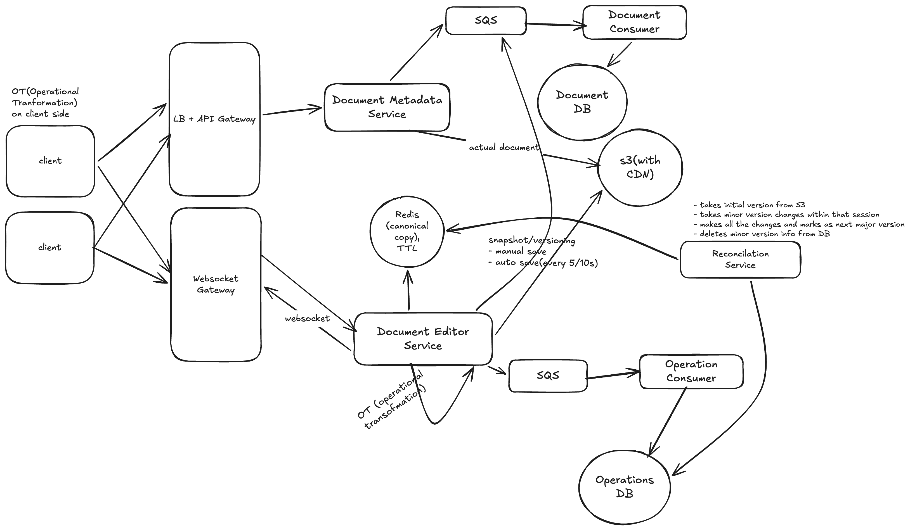

# Design a collaborative text editor like google docs

## functional requirements

- user should be able to create/update/delete documents
- multiple users should be able to edit the same document simultaneously
- user should be able view each others changes in real-time
- user should be able to see other users cursor position and presence of other users
- versioning of the files

## non functional requirements

- scale: 10M users, 1B documents
- CAP theorem: high avaialbility for offline operations, high consistency for collaborative design
- Latency: Updates should be low latency < 100ms

## Core Entity

- User
- Document
- DocumentEdit
- Cursor

## API design

- POST /v1/docs/create - create a document (response: doc_id)
- GET /v1/docs/:doc_id - view document (read only)
- GET /v1/docs/:doc_id/versions - Fetch versions (list of version_ids)
- GET /v1/docs/:doc_id/versions/:version_id - Returns readonly copy of the doc with that version
- DELETE /v1/docs/:doc_id - delete document (delete document)
- WS: /v1/docs/:doc_id - edit document

## HLD


## Deep Dive

- `Document Metadata Service`: handles all request to update metadata of document
  - `Document DB`: Cassandra (Write Heavy)
    - `Metadata` table: doc_id, doc_title, url, created_by, created_at, last_modified_time, last_modified_by, ...metadata
    - `Version` table: doc_id, version_id, created_by, url, last_modified_time, ...metadata
- `Document Editor Service` - Heart of our system, this is where multiple users edit a single document in real time and discuss how to resolve all conflicts in near real-time
  - we use a websocket connection to reduce number of requests happening between backend service and client
  - for changes, instead of changing the entire file as a change, we only send the `delta` (difference) of the 2 existing files as payload (example: for inserting `R` at position `29`, we do something like `insert(R, 29)`)

- Operations Database:
  - Operations table: document_id, timestamp, event, data, ...metadata

There are 2 main algorithms to solve this sort of collaborative design problem:

### OT (Operational Transformation):

OT transforms concurrent operations during merging. Transformation function ensures that the effect of an operation takes into account the changes made by other operations

#### Example

- Existing doc BC (at positions 0,1)
- Alice inserts `A` to `0` i.e `insert(A,0)`
- at the same time Bob inserts `D` to `2` i.e `insert(D, 2)`
- The transformation function sees Alice changes and so accordingly takes it into consideration and does `insert(D, 3)` - thus both Alice and Bob doc clients see `ABCD`

#### Limitations/Drawbacks

- All operations must go through a single server which does the transformation
- Implementation is very very complex

### CRDT (Conflict-free Replicated Data Types)

CRDTs are data structures specifically designed for distributed systems that automatically resolve conflicts during concurrent updates to a single resource. These ensure eventualy consistency without any coordination, by using mathematical properties which allow operations to be merged in any order

CRDTs ensure that, no matter what data modifications are made on different replicas, the data can always be merged into a consistent state

#### Example

- Existing Doc: BC - B has assigned position 0.5 and C has assigned position 0.75
- Alice inserts `A` - so `insert(A, 0.25)`
- Concurrently, Bob inserets `D` - so `insert(D, 0.875)`
- When we reconcile the data together both doc clients of Alice and Bob see `ABCD(0.25,0.5,0.75,0.875)` i.e we reconcile based on the index value assigned

### Data flow

- User requests a file -> request comes to metadata service -> file fetched from S3 and returned as a view-only mode
- if user has apt permissions to write/edit the doc -> a WS connection(first http request then handshake then bidirectional websocket connection) gets established
- Document editor service fetches a copy of the document from S3 (there is another with the client as well)
- once user makes changes to their local copy, an `Edit` event is generated which comes to document editor service via websocket connection
- once request comes to document editor service, 2 things happen:
  - persists that event for durability to Operations database
  - changing the local copy but we need to keep this in memory of backend service via a redis cluster
  - so temporary changes done in redis cluster, permanent changes to the file kept in s3



## Deep Dive (walkthrough)

### 0. The 30-second pitch

> "Documents live in **S3 behind a CDN**, and their metadata and version list live in **Cassandra**. Viewing a doc is a plain HTTP read. Editing opens a **WebSocket** to a **Document Editor Service**, and every doc is owned by **exactly one editor server**, so there is a single place that orders edits. Clients send small **deltas**, not the whole file. The server runs **OT with revision numbers**: each op says which revision it was based on, the server transforms it against anything newer, gives it the next revision, and broadcasts it. The live copy of the doc sits in **Redis with a TTL**. Every op is appended to an **operations log** (SQS → Cassandra), the doc is **snapshotted to S3 every 5–10s** or on manual save, and a **Reconciliation Service** folds the minor changes into the next major version when the session ends."

---

### 1. Flow 1: Create and view a document

`POST /v1/docs/create` → `doc_id`, `GET /v1/docs/:doc_id` (read only)

```
Client → LB + API Gateway → Document Metadata Service
   ├─→ S3 (with CDN)   → the actual document content (empty file on create)
   └─→ SQS → Document Consumer → Document DB (Cassandra)
                                  └─ Metadata table row (title, url, created_by, ...)
← create: returns doc_id    |    view: returns metadata + CDN url of the latest version
```

- **Key point:** the service generates the `doc_id` (a UUID) itself and returns it right away. The consumer writes the row with an upsert on `doc_id`, so a retried SQS message is harmless (idempotent).
- **Why split S3 and Cassandra?** Content is large and opaque, so it goes in cheap blob storage. Metadata is small and queried by `doc_id`, so it goes in a key-value style DB.
- **Why a CDN?** Read-only views are the most common request. The CDN serves them close to the user and keeps load off S3 and the services.
- **Why SQS in front of Document DB?** Metadata writes (`last_modified_time`, new versions) arrive often during editing. The queue absorbs bursts and keeps the write off the request path.
- **Metadata table:** doc_id, doc_title, url, created_by, created_at, last_modified_time, last_modified_by, ...metadata

---

### 2. Flow 2: Opening a document for editing (session setup)

`WS /v1/docs/:doc_id`

```
Client → HTTP upgrade → WebSocket Gateway (checks auth + edit permission)
   └─→ route by hash(doc_id) → the ONE Document Editor Service instance that owns this doc
          ├─ doc already live in Redis? → use it (another user is already editing)
          └─ not live → load latest snapshot from S3 (at revision R)
                        + replay ops with revision > R from Operations DB
                        → write canonical copy + current revision into Redis (with TTL)
← server sends the doc content + current revision number to the client
```

- **Key point:** every WebSocket for the same `doc_id` lands on the same editor server. OT needs a single server that decides the order of edits (this is the "single server" limitation noted above), so we make it a deliberate design choice.
- **How is the owner chosen?** A consistent hash ring on `doc_id`. Ownership is held as a lease (a ZooKeeper ephemeral node, or a Redis key with a TTL) so two servers can never both think they own a doc.
- **Why a snapshot + op log?** Loading the latest snapshot and replaying only the few ops after it is fast. Replaying the whole history of a doc would not be.
- **Why a TTL in Redis?** When everyone leaves, the live copy expires on its own. Only active documents take up memory, which matters with 1B documents but few open at once.

---

### 3. Flow 3: Real-time editing with OT (the core deep dive)

WS message: `{doc_id, client_id, client_seq, base_rev, op: insert(R, 29)}`

```
Client makes an edit → applies it locally at once (feels instant)
   → sends the op with base_rev = the last revision it has seen
Document Editor Service (owner of the doc):
  1. current revision in Redis = N
  2. base_rev == N → apply the op as is
     base_rev <  N → transform the op against ops (base_rev+1 .. N) from Redis
  3. apply the op to the canonical copy in Redis, set revision = N+1 (atomic)
  4. append {doc_id, revision N+1, op, user, ts} → SQS → Operation Consumer → Operations DB
  5. ACK the sender with revision N+1
  6. broadcast the transformed op + revision N+1 to every other client on this doc
Other clients: transform the incoming op against their own un-ACKed ops, then apply
```

#### How the server actually applies OT (revision numbers)

- The server gives every accepted op the next **revision number**. That number is the one true order of edits for the doc.
- The client says which revision its op was based on (`base_rev`). Anything newer than that is something the client hadn't seen, so the server transforms the op against it.
- Using the README's example: the doc is `BC` at revision 5. Alice sends `insert(A,0)` and Bob sends `insert(D,2)`, both with `base_rev = 5`.
  - Alice's op arrives first. It is applied as is and becomes revision 6.
  - Bob's op has `base_rev = 5 < 6`, so it is transformed against Alice's insert and becomes `insert(D,3)`. It is revision 7.
  - Everyone ends up with `ABCD` at revision 7.
- **Ties** (two inserts at the same position) are broken the same way everywhere, for example by server order or by `client_id`, so all clients get the same result.
- **OT on the client side** (from the diagram): each client keeps one op in flight and buffers the rest until it is ACKed. When a server op arrives, the client transforms it against its pending ops before applying it. This keeps the client in step with the server without locking the document.

#### The race condition (a very common interview question)

- **Problem 1: two edits based on the same revision.** Without revisions, the server would apply both at their original positions and the clients' copies would drift apart.
  - **Solution:** the revision check plus transform above. The "read revision, apply, bump revision" step is atomic (a Redis Lua script, or compare-and-set on the revision), so two ops can never both become revision N+1.
- **Problem 2: two editor servers accept edits for the same doc** (for example during a failover or a deploy). Each would build its own order and the doc would fork.
  - **Solution:** a single owner per doc, held by a lease. The atomic compare-and-set on the revision in Redis also acts as a fence: if a stale server tries to write revision N+1 after the new owner already has, its write fails.
- **Problem 3: a client resends an op after a reconnect.**
  - **Solution:** `(client_id, client_seq)` is an **idempotency key**. The server remembers the last seq per client and ignores duplicates. The Operations DB is keyed by `(doc_id, revision)`, so a replayed SQS message just overwrites the same row.

#### Durability and ordering of the op log

- The server ACKs the client only after the op is in Redis and handed to SQS. If the server crashes after that, the op is not lost.
- Use an **SQS FIFO queue with `MessageGroupId = doc_id`** (or Kafka partitioned by `doc_id`). Because each op carries its revision, the Operations DB is ordered by revision, not by arrival time.
- **Operations table** (a small fix to the one above: order by revision rather than timestamp): doc_id (partition key), revision (clustering key), op, user_id, client_seq, timestamp, ...metadata

#### CAP mapping (say this explicitly)

- **Editing a document needs consistency:** all editors must converge on the same text, which is why one server orders every op.
- **Everything else favours availability:** read-only views come from the CDN, metadata is updated through SQS (eventually consistent), and offline users keep editing locally. Their ops are sent with their old `base_rev` when they reconnect and are transformed like any other late op.

---

### 4. Flow 4: Cursors and presence

WS message: `{doc_id, user_id, cursor_pos, selection}`

```
Client moves cursor → WS Gateway → Document Editor Service (owner)
   ├─→ Redis: presence:{doc_id} → user_id → {cursor_pos, color, last_seen} (short TTL)
   └─→ broadcast to the other clients on this doc (not persisted, not versioned)
```

- **Key point:** cursors are ephemeral. They are never written to the Operations DB or S3.
- **Keeping cursors correct:** a cursor position is shifted by other users' edits exactly like an insert is (an insert before your cursor moves it right).
- **Why a short TTL?** If a user's tab closes without a clean disconnect, they drop out of the "who's here" list on their own.
- Cursor updates can be throttled (for example every 50–100ms) since only the latest position matters.

---

### 5. Flow 5: Snapshots, versioning and reconciliation

```
Document Editor Service (auto save every 5/10s, or manual save):
   ├─→ S3: write snapshot of the Redis copy at revision R   (a minor version)
   └─→ SQS → Document Consumer → Document DB (Version table + last_modified_time)

Reconciliation Service (when the session ends / Redis TTL expires):
   1. takes the last major version from S3
   2. takes the minor changes from that session (Redis / Operations DB)
   3. applies them and writes the result to S3 as the next major version
   4. writes the new row in the Version table
   5. only after 3 and 4 succeed → deletes the minor version info (ops up to R) from Operations DB
```

- **Key point:** step 5 must run last. If the service crashes in the middle, the ops are still there and the job can simply run again (it is idempotent because it works by revision).
- **Why snapshot every 5–10s?** It bounds how many ops you replay when loading a doc or recovering from a crash.
- **Why delete minor ops?** Keeping every keystroke for 1B documents forever is expensive. Once they are folded into a major version they are no longer needed.
- **Version table:** doc_id, version_id, created_by, url (S3 key), last_modified_time, ...metadata. Adding the revision number the version was cut at makes "load snapshot + replay ops after it" straightforward.

---

### 6. Flow 6: Version history and delete

`GET /v1/docs/:doc_id/versions`, `GET /v1/docs/:doc_id/versions/:version_id`, `DELETE /v1/docs/:doc_id`

```
Versions list    → Metadata Service → Document DB (Version table, partition = doc_id) → list of version_ids
One version      → Metadata Service → Version row → S3/CDN url → read-only copy
Delete           → Metadata Service → mark deleted in Metadata table (soft delete)
                                    → close open WS sessions for the doc
                                    → background job removes S3 objects + ops later
```

- **Why soft delete?** Hard deleting across S3, Cassandra and Redis at once is slow and can fail halfway. A flag makes the doc disappear immediately, and cleanup can retry safely.
- **Restoring a version** is just "take that snapshot and save it as the next major version", so history is never rewritten.

---

### Data stores at a glance

| Store | Tech | Holds | Why |
|---|---|---|---|
| Document DB | Cassandra | Metadata table, Version table | Write heavy, simple lookups by `doc_id`, scales to 1B docs |
| Object store | S3 + CDN | Document content, snapshots, major versions | Cheap, durable blobs; CDN serves read-only views fast |
| Live doc cache | Redis (TTL) | Canonical copy, current revision, recent ops, presence | Sub-millisecond reads/writes to hit the < 100ms target |
| Operations DB | Cassandra (partition `doc_id`, clustering `revision`) | Every edit op | Append-only, very write heavy, read in revision order |
| Queues | SQS (FIFO for ops) | Metadata updates, op log writes | Absorbs bursts, keeps durable writes off the hot path |
| Doc ownership | Consistent hashing + ZooKeeper/Redis lease | doc_id → editor server | Guarantees one server orders each doc's edits |

---

### Quick-fire answers to likely follow-ups

- **"Why OT and not CRDT?"** With one server per doc there is already a single place to order edits, so OT is simpler to run and uses less metadata per character. CRDTs shine when there is no central server (peer to peer, heavy offline use), at the cost of larger documents.
- **"What if the editor server crashes?"** Its lease expires and another server takes the doc. It loads the canonical copy from Redis (or the latest snapshot + ops from Operations DB). Clients reconnect and resend any un-ACKed ops, which are deduplicated by `(client_id, client_seq)`.
- **"How do you get < 100ms?"** Clients apply their own edits instantly, send only deltas over an open WebSocket, and the server only touches Redis in the hot path. The S3 and Cassandra writes are asynchronous.
- **"What about a doc with thousands of editors?"** One server per doc becomes the bottleneck. Cap active editors (for example about 100), make the rest viewers, and batch broadcasts.
- **"How does offline editing work?"** The client queues its ops with the last revision it saw. On reconnect it sends them, and the server transforms them against everything that happened meanwhile.
- **"Why WebSockets and not polling?"** Edits and cursors flow both ways many times a second. A persistent connection avoids opening a request per keystroke and lets the server push changes.
- **"How big is storage?"** 1B docs at about 100KB each is about 100TB of current content in S3, plus versions. Ops are trimmed after reconciliation, so the op log stays small.
- **"How are permissions checked?"** At the WebSocket handshake (and on every HTTP request) via the Metadata Service. View-only users get the CDN copy and no edit socket.
