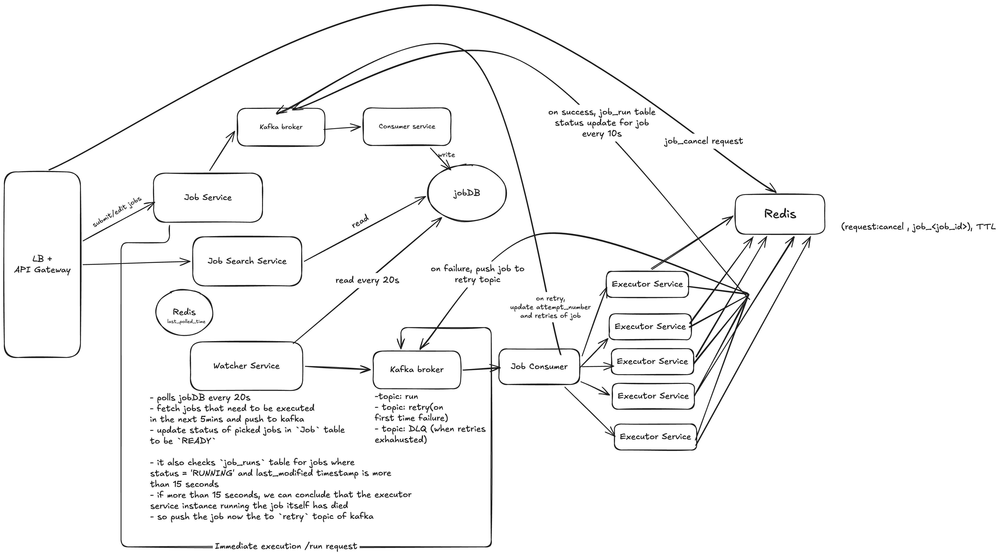

# Design a distributed job scheduler (Like airflow, temporal)

Basically a job scheduler runs certain jobs at scheduled intervals of time (like CRON jobs). Used to automated repititive tasks,
run scheduled maintenance, execute batch processes in real time, etc

## functional requirements

- user should be able to create and schedule a job at any given point of time (immediate/future/cron)
- user should be able to monitor status of the job
- user should be able to cance/reschedule

Out of scope: Dependence in job (DAG) i.e one job dependent on another job

## non functional requirements

- Scale: 10,000 concurrent jobs/sec
- CAP thereom: availability >> consistency (eventually consistent)
- Job should run at least once
- scheduled jobs should get executed within 2 seconds of expected schedule i.e latency <= 2s

## Core Entity

- Job
- Scheduler
- Executor Service

## API design

- POST /v1/api/jobs - body: {job_details, schedule} -> create/schedule a job -> HTTP 201 response with job_id
- GET /v1/api/jobs/:job_id - fetch job details
- GET /v1/jobs/:job_id/status - get current status
- PUT /v1/jobs/:job_id - to update metadata/schedule of an existing job
- POST /v1/jobs/:job_id/cancel - to cancel a scheduled/running job
- POST /v1/jobs/:job_id/run - to immediately run a job

## Deep Dive

- jobDB (Postgres)
  - `job` Table(id, user_id, name, schedule_type, status(PAUSE/CANCELLED/RUNNING/SCHEDULED), schedule_time, cron_expression, payload, retries, ...metadata)
    - partitioned by `schedule_time`, index: `status`
  - `job_run` table, acts as a tracker for the running jobs - (id, job_id, status(queued/running/success/failed), start_time, end_time, modified_time, executor_id, attempt_number, error_msg)
    - `status + modified_time` index



### 0. The 30-second pitch

> "Users create jobs (one-off, future or cron) through a **Job Service**. Writes go through **Kafka** to a consumer that persists them in **Postgres (jobDB)**, partitioned by `schedule_time`. A **Watcher Service** polls jobDB every 20s, claims the jobs due in the next 5 minutes and releases each one to a Kafka **`run` topic** when it is due. A **Job Consumer** hands jobs to a pool of **stateless executors**. Executors **heartbeat every 10s** into the `job_run` table. If a heartbeat goes stale, the watcher assumes the executor died and pushes the job to a **`retry` topic**, with a **DLQ** once retries run out. Delivery is **at-least-once**, so jobs must be **idempotent**. Cancels are flags in **Redis with a TTL** that executors check."

---

### 1. Flow 1: Create / update a job

`POST /v1/api/jobs {job_details, schedule}` and `PUT /v1/jobs/:job_id`

```
User → LB + API Gateway → Job Service
   ├─ validate schedule (cron expression / future time / immediate)
   ├─ generate job_id (UUID / Snowflake) → return HTTP 201 {job_id}
   └─→ Kafka broker (job-writes topic)
          └─→ Consumer Service → jobDB.job  (status = SCHEDULED, schedule_time = next fire time)
```

- **Key point:** the Job Service creates the `job_id` itself, so it can return 201 straight away without waiting for the DB write.
- **Why Kafka in front of the DB?** It absorbs write bursts (10k jobs/sec) and keeps the API available if Postgres is slow. This fits the "availability over consistency" requirement. The trade-off is that a job may take a moment to show up in reads (eventual consistency).
- **Idempotency:** the client sends an idempotency key, and the consumer upserts on `job_id`. A replayed Kafka message then never creates a duplicate job.
- **Cron jobs:** store `cron_expression` and set `schedule_time` to the **next** fire time. After each run is dispatched, compute the next `schedule_time` and write it back. The table always holds one upcoming occurrence per cron job, not an endless list.
- **job table:** id, user_id, name, schedule_type (IMMEDIATE/ONE_TIME/CRON), status (SCHEDULED/READY/RUNNING/PAUSED/CANCELLED), schedule_time, cron_expression, payload, retries, ...metadata. Partitioned by `schedule_time`, indexed on `status`.

---

### 2. Flow 2: Monitor a job

`GET /v1/api/jobs/:job_id` and `GET /v1/jobs/:job_id/status`

```
User → LB + API Gateway → Job Search Service → jobDB (read replicas)
   ├─ job table     → definition, schedule, overall status
   └─ job_run table → latest run: status, attempt_number, start/end time, error_msg
```

- **Why a separate read service?** Reads (users polling for status) far outnumber writes. It can scale on its own and read from **replicas**. Slightly stale status is fine here.
- **job_run table:** id, job_id, status (QUEUED/RUNNING/SUCCESS/FAILED), start_time, end_time, modified_time, executor_id, attempt_number, error_msg. Indexed on `status + modified_time`, which is exactly what the watcher's stale-job query needs.

---

### 3. Flow 3: Scheduling, dispatch and execution (the core deep dive)

```
Watcher Service (every 20s)
  1. Read last_polled_time from Redis
  2. Claim due jobs from jobDB:
        schedule_time <= now + 5 min AND status = SCHEDULED
        → UPDATE status = READY (conditional, so only one watcher wins each row)
  3. Hold claimed jobs in a timer (Redis sorted set, score = schedule_time)
     → when a job is due, push {job_id, attempt_number} to Kafka topic `run`
  4. Save the new last_polled_time to Redis

Kafka `run` topic (partitioned by job_id) → Job Consumer → Executor Service (pool)
  5. Executor inserts job_run row (status = RUNNING, executor_id, attempt_number, start_time)
  6. While running: heartbeat every ~10s → Kafka → Consumer Service → job_run.modified_time
  7. Finishes:
        ├─ SUCCESS → job_run.status = SUCCESS, end_time
        │            (cron: set the next schedule_time, job back to SCHEDULED)
        └─ FAILURE → push to `retry` topic (attempt_number + 1, with backoff)
                     → retries exhausted → `DLQ` topic, job_run.status = FAILED

Watcher Service (stale-run check, same loop)
  8. job_run WHERE status = RUNNING AND modified_time < now - 15s
     → executor is presumed dead → push to `retry` topic
```

#### Why the 5-minute look-ahead plus a timer?

- Polling every 20s alone can't meet the **≤ 2s latency** requirement. A job due 1s after a poll would wait about 19s.
- So the watcher **prefetches** the next 5-minute window and hands each job to Kafka **at its exact time** from a timer (a Redis sorted set that is checked about every second). The DB is queried rarely, and dispatch is still precise.
- Don't push to `run` as soon as the job is fetched. Kafka has no delayed delivery, so the job would run up to 5 minutes early.
- **Why `last_polled_time` in Redis?** If a watcher restarts, the next one continues from where it left off, so no time window is skipped.
- **Why partition jobDB by `schedule_time`?** The hot query is always "jobs due soon", so it only touches the latest partition. Old partitions can be archived or dropped.

#### Why Kafka between watcher and executors?

- It decouples scheduling from execution. Executors scale on their own, and a spike of due jobs is buffered instead of dropped.
- Separate topics give a clean failure path. `run` is for first attempts, `retry` is for failures with backoff, and `DLQ` holds jobs that ran out of retries so a human can inspect them.
- Partitioning by `job_id` keeps the attempts of one job in order.

#### The race conditions (a very common interview question)

**Problem 1: two watchers pick the same job.** You run several watchers for availability. Both poll at the same moment, both see job 42 as due, and both push it. The job runs twice.

- **Solution:** claim with a **conditional update**. Only the watcher whose update succeeds dispatches the job.
  - `UPDATE job SET status='READY' WHERE id=42 AND status='SCHEDULED'`. Check that 1 row was updated.
  - Or `SELECT ... FOR UPDATE SKIP LOCKED LIMIT N` in batches, so watchers split the work without blocking each other.
  - Or give each watcher its own set of partitions or shards (through ZooKeeper or a leader lease), so no two watchers ever scan the same rows.

**Problem 2: an executor is "dead" but actually alive (zombie).** A GC pause or network blip stops heartbeats for more than 15s. The watcher retries the job on another executor, then the first executor wakes up and finishes too.

- **Solution:** treat the heartbeat as a **lease**, and fence it with `attempt_number`.
  - The retry bumps `attempt_number`. Every status write is conditional: `UPDATE job_run ... WHERE job_id=? AND attempt_number=<mine>`. The old executor's writes are rejected, and it should stop when it sees that.
  - Set the stale threshold to **2–3 missed heartbeats** (for example, heartbeat 10s and timeout 30s). With only 15s, one slow heartbeat triggers a false retry.

**Problem 3: at-least-once vs exactly-once.**

- The requirement is **at-least-once**. Kafka redelivers when a consumer crashes before committing its offset, and the watcher re-dispatches stale runs. So **duplicates will happen**.
- True exactly-once execution isn't possible when jobs have side effects outside the system. The standard answer is **at-least-once delivery + idempotent jobs**.
  - Pass `job_id + attempt_number` (or `job_id + schedule_time` for cron runs) to the job as an **idempotency key**. The job, or the system it calls, drops repeats.
  - The Job Consumer commits the Kafka offset only after the `job_run` row exists, so a crash causes a redelivery, never a lost job.

#### CAP mapping (say this explicitly)

- **Overall: availability over consistency.** Job submission and status reads keep working through Kafka and replicas, even if what they show is a bit stale.
- **The claim step needs consistency.** "Who owns this job run" is decided by a conditional write on a single Postgres row, so a job is never dispatched twice by the scheduler itself. Duplicates from failures are handled by idempotency.

---

### 4. Flow 4: Immediate run

`POST /v1/jobs/:job_id/run` (or a job created with schedule_type = IMMEDIATE)

```
User → API GW → Job Service ──(skips the watcher)──→ Kafka topic `run`
                     └─→ Kafka → Consumer Service → jobDB (record the run request)
Kafka `run` → Job Consumer → Executor (same path as Flow 3, steps 5–7)
```

- **Key point:** immediate jobs go straight to the `run` topic. Waiting for the next 20s poll would break the 2s latency goal.
- The executor still creates a `job_run` row, so monitoring, heartbeats and retries work the same way.

---

### 5. Flow 5: Cancel / reschedule

`POST /v1/jobs/:job_id/cancel` and `PUT /v1/jobs/:job_id`

```
User → API GW → Job Service
   ├─→ jobDB (via Kafka): job.status = CANCELLED   → the watcher will no longer claim it
   └─→ Redis: SET request:cancel:job_<job_id> 1 EX <ttl>
Executors / Job Consumer check the Redis key:
   ├─ before starting a job → skip it
   └─ while running (with each heartbeat) → stop the job, job_run.status = CANCELLED
```

- **Why Redis and not only the DB?** The job may already be in Kafka or running. Executors need a very cheap check they can do on every heartbeat, and Redis gives that.
- **Why a TTL?** The flag only matters while a copy of the job might still be in flight (queued or running). After that it expires by itself, so Redis doesn't fill up with old cancel flags.
- **Reschedule:** update `schedule_time` / `cron_expression` and set status back to SCHEDULED. If the job was already claimed into the current 5-minute window, remove it from the watcher's timer, or cancel that run with the Redis flag.

---

### Data stores at a glance

| Store | Tech | Holds | Why |
|---|---|---|---|
| jobDB `job` | Postgres, **partitioned by schedule_time** | Job definitions, schedule, status | The "due soon" query hits one partition; conditional updates for claiming |
| jobDB `job_run` | Postgres, index `status + modified_time` | One row per attempt, heartbeat time | Monitoring, and finding stale runs |
| Kafka (write path) | Stream | Job create/update events, heartbeats | Absorbs write bursts and keeps the API available |
| Kafka (execution) | Topics `run`, `retry`, `DLQ` | Jobs ready to execute | Decouples scheduling from execution; clean retry path |
| Redis (watcher) | In-memory | `last_polled_time`, due-job timer (sorted set) | Watcher can resume after a crash; dispatch at the exact second |
| Redis (cancel) | In-memory, TTL | `request:cancel:job_<id>` | Cheap cancel check for in-flight jobs |

---

### Quick-fire answers to likely follow-ups

- **"How do you hit 2s latency if you poll every 20s?"** The poll prefetches 5 minutes ahead, and a timer releases each job to Kafka at its exact time. Immediate jobs skip the poll.
- **"What if the watcher crashes?"** Run several watchers with claiming by conditional update, or partition ownership through a leader lease. `last_polled_time` in Redis lets the next one resume without gaps.
- **"What if an executor dies mid-job?"** Heartbeats stop, the watcher sees a stale `modified_time` and pushes the job to `retry` with a higher `attempt_number`.
- **"Can a job run twice?"** Yes, rarely. That's the cost of at-least-once. Jobs use `job_id + attempt_number` as an idempotency key, and `attempt_number` fences out old executors.
- **"How do retries avoid hammering a failing dependency?"** Exponential backoff with jitter on the `retry` topic, a max from the job's `retries` field, then the DLQ.
- **"How do you handle 10k jobs/sec?"** Partition Kafka by `job_id`, scale executors horizontally, shard the watcher's scan by partition, and batch the DB claims.
- **"What about long-running jobs?"** The heartbeat keeps the lease alive for as long as the job runs, so the watcher doesn't treat it as dead. Add a per-job max runtime to kill stuck jobs.
- **"Why not just use cron on one box?"** It's a single point of failure, it can't scale to 10k/sec, and it can't retry or report status across machines.
