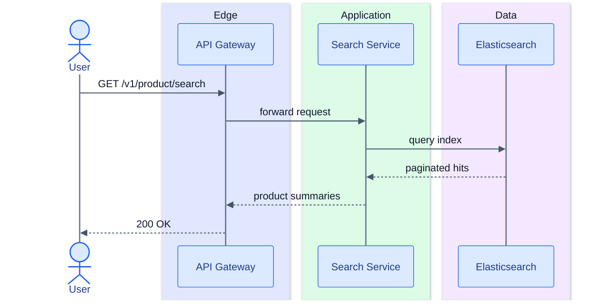
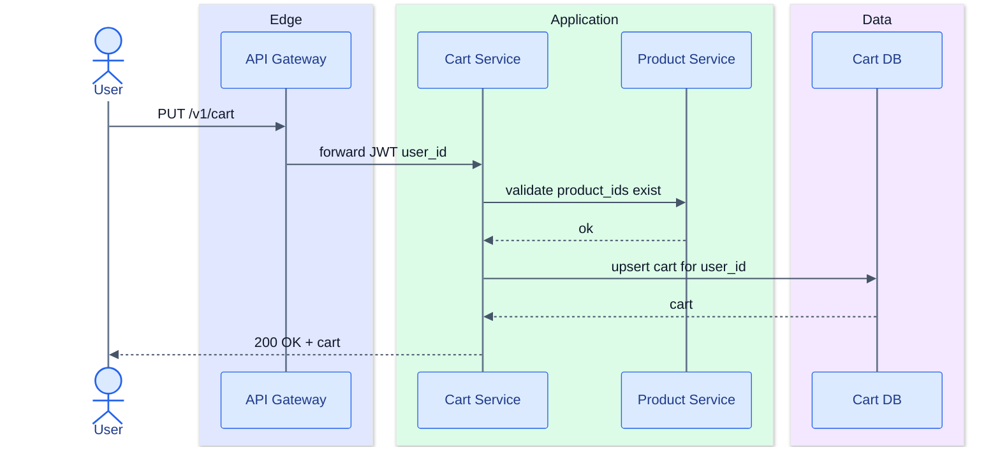
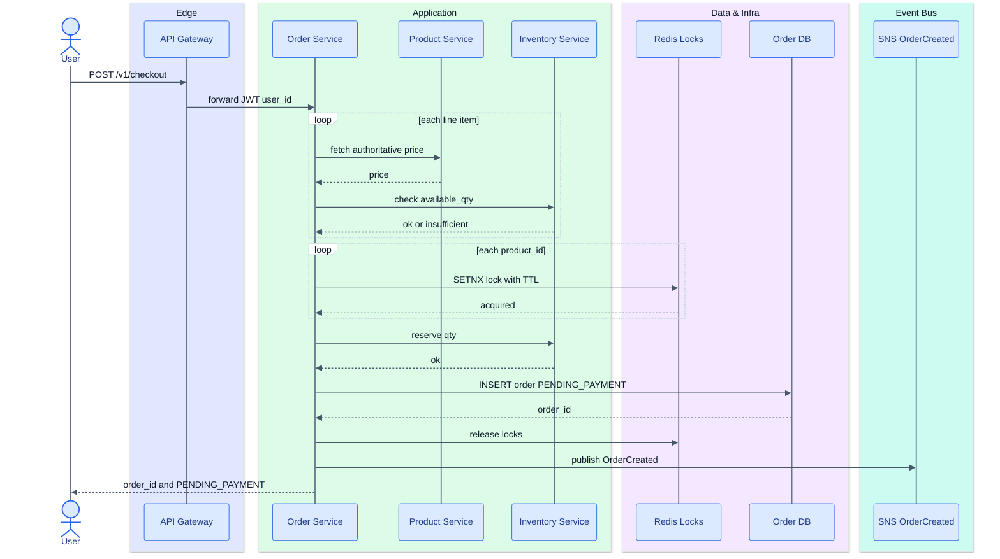
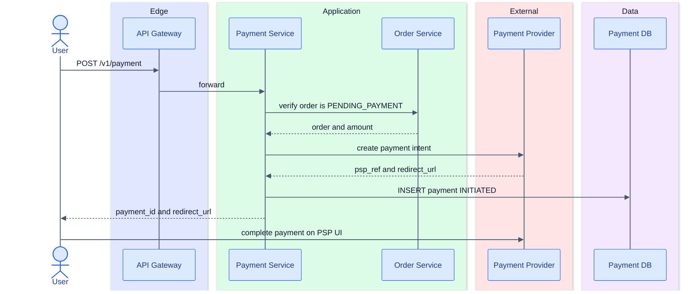
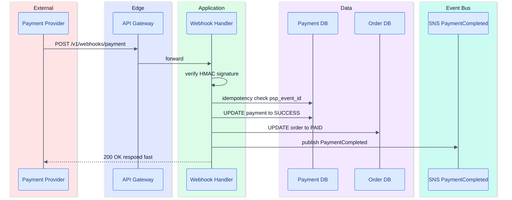
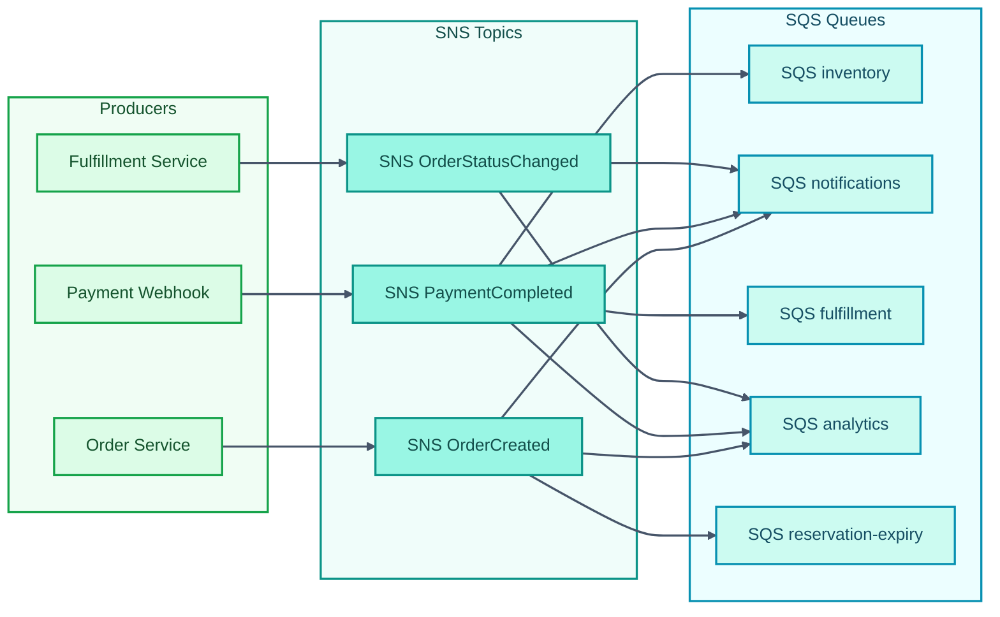
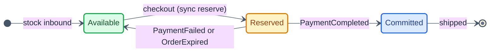
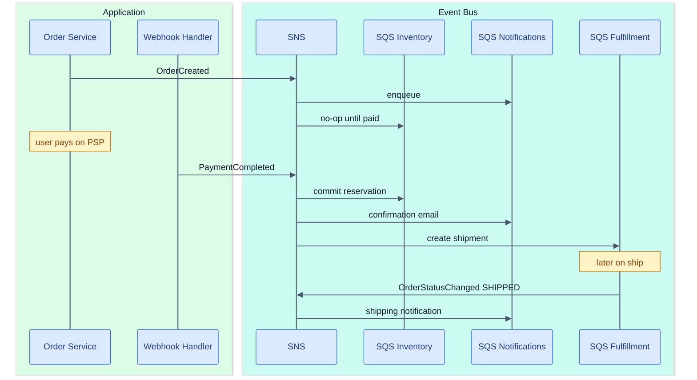

# Design an e-commerce platform like Flipkart/Amazon

## function requirements

- user login and search any product based on title/name
- should be able to see product detail including description, image, available quantity, reviews etc
- user should be able to select intended quantity of the product and add it to cart
- should be able to perform payment and checkout successfully
- user should be able to track status of order
- limited stock of products to be managed properly in case of concurrent order requests

## non functional requirements

- scale: 10M monthly active users, 10 orders/second acceptance
- CAP theorem: search and viewing items should be highly available. order placement and payments should be highly consistent.
- low latency for search ~200ms

## core entity

- User
- Product
- Cart
- Orders
- Checkout/Payment

## API creation

- `POST /v1/auth/login` -> body: `{email, password}` -> returns JWT/session
- `GET /v1/product/search?q={searchTerm}` -> Response: Paginated `List<Product> Partial info`
- `GET /v1/product/:product_id` -> response product details (metadata)
- Add to cart `PUT /v1/cart` -> body: `{items: [{product_id, quantity}]}` -> return cart (full replace; simplifies add/remove/edit)
- Place Order/Checkout `POST /v1/checkout` -> body: `{items: [{product_id, quantity}]}` -> return `{order_id, amount, status}` (price validated server-side, not trusted from client)
- Payment `POST /v1/payment` -> body: `{"order_id": <order_id>, payment_details: {...}}` -> returns `{payment_id, redirect_url | client_secret}` (initiates payment; confirmation via webhook)
- `POST /v1/webhooks/payment` -> PSP callback (signature-verified, idempotent) -> updates order/payment status async
- `GET /v1/orders/:order_id` -> order status, line items, timeline

## HLD


## Deep Dive

### Choice of DB

- User DB: `Postgres/MySQL` since relatively simple simply for storing User Data
  - User Table(name, email, hashed_password, address_list, contact_no)
- Search DB: `ElasticSearch` cluster with indexed products
- Product DB: Needs rich nested metadata schema and is optimised for searching complex nested structures - so `MongoDB`
  - Product collection: (product_id, name, description, category, price, currency, image_urls) — live qty fetched from Inventory Service, not stored here
  - Images uploaded to an S3 bucket and served via CDN (CloudFront distribution) — URLs saved in DB and Elasticsearch
- Cart DB: `Postgres`
  - Cart Table (cart_id, user_id, products: [{product_id, qty}]) - and for prices it would reach out to product db for updated prices
- Inventory service: source of truth for product availability. Postgres DB
  - Inventory table: `(product_id PK, available_qty, reserved_qty)` — `available_qty` is what search/detail reads; reservations move stock out of available during checkout
  - Reservation table (optional but recommended): `(order_id, product_id, qty, status: HELD | COMMITTED | RELEASED)` — ties commit/release to a specific order for idempotency
- Order DB (Postgres)
  - Order table: `(order_id, user_id, status, line_items[], total, created_at)`
  - Payment table: `(payment_id, order_id, psp_ref, status, idempotency_key)`

### System architecture (HLD)

Full platform topology — all services, stores, external integrations, and event bus. Solid arrows are **synchronous** request/response paths; dotted arrows are **async** (events, webhooks, catalog sync).

```mermaid
%%{init: {'theme': 'base', 'themeVariables': {'darkMode': false, 'background': '#ffffff', 'primaryColor': '#ffffff', 'primaryTextColor': '#1e293b', 'primaryBorderColor': '#64748b', 'lineColor': '#475569', 'secondaryColor': '#f8fafc', 'tertiaryColor': '#f1f5f9', 'clusterBkg': '#f8fafc', 'clusterBorder': '#94a3b8', 'titleColor': '#0f172a', 'edgeLabelBackground': '#ffffff', 'nodeTextColor': '#1e293b', 'textColor': '#1e293b'}, 'themeCSS': 'svg { background-color: #ffffff !important; } .edgeLabel rect { fill: #ffffff !important; stroke: #cbd5e1 !important; } .edgeLabel span, .edgeLabel .label { color: #0f172a !important; fill: #0f172a !important; } .nodeLabel, .nodeLabel tspan { fill: #1e293b !important; } .cluster-label, .cluster-label tspan { fill: #0f172a !important; }'}}%%
flowchart TB
    subgraph ClientLayer["Client Layer"]
        User[User / Web App]
    end

    subgraph StaticLayer["Static Assets"]
        CDN[CloudFront + S3 Images]
    end

    subgraph EdgeLayer["Edge"]
        GW[API Gateway]
    end

    subgraph AppLayer["Application Services"]
        direction TB
        Auth[Auth Service]
        Search[Search Service]
        Product[Product Service]
        Cart[Cart Service]
        Order[Order Service]
        Pay[Payment Service]
        WH[Webhook Handler]
        Inv[Inventory Service]
        Fulfill[Fulfillment Service]
    end

    subgraph DataLayer["Data Stores"]
        direction TB
        UserDB[(User DB)]
        ES[(Elasticsearch)]
        Mongo[(Product DB)]
        CartDB[(Cart DB)]
        OrderDB[(Order DB)]
        InvDB[(Inventory DB)]
        Redis[(Redis)]
    end

    subgraph ExternalLayer["External"]
        PSP[Payment Provider]
    end

    subgraph EventLayer["Event Bus — SNS + SQS"]
        direction TB
        SNS[SNS Topics]
        SQS[SQS Queues + DLQ]
        NotifyW[Notification Worker]
        InvW[Inventory Worker]
        FulfillW[Fulfillment Worker]
        AnalyticsW[Analytics Worker]
        ExpiryW[Reservation Expiry Worker]
    end

    User -->|"A: images"| CDN
    User -->|"B–H: API calls"| GW
    PSP -->|"G: payment webhook"| GW

    GW --> Auth
    GW --> Search
    GW --> Product
    GW --> Cart
    GW --> Order
    GW --> Pay
    GW --> WH

    Auth --> UserDB
    Search --> ES
    Product --> Mongo
    Product --> Inv
    Cart --> CartDB
    Cart --> Product
    Order --> Product
    Order --> Inv
    Order --> Redis
    Order --> OrderDB
    Pay --> Order
    Pay --> OrderDB
    Pay --> PSP
    WH --> OrderDB
    Inv --> InvDB
    Fulfill --> OrderDB

    Product -.->|"catalog sync (async)"| ES
    Order -.->|"OrderCreated (async)"| SNS
    WH -.->|"PaymentCompleted / Failed (async)"| SNS
    Fulfill -.->|"OrderStatusChanged (async)"| SNS

    SNS --> SQS
    SQS --> NotifyW
    SQS --> InvW
    SQS --> FulfillW
    SQS --> AnalyticsW
    SQS --> ExpiryW

    InvW --> Inv
    FulfillW --> Fulfill
    ExpiryW --> Inv

    classDef client fill:#dbeafe,stroke:#2563eb,color:#1e3a8a,stroke-width:2px
    classDef static fill:#fef3c7,stroke:#d97706,color:#92400e,stroke-width:2px
    classDef edge fill:#e0e7ff,stroke:#4f46e5,color:#312e81,stroke-width:2px
    classDef app fill:#dcfce7,stroke:#16a34a,color:#14532d,stroke-width:2px
    classDef data fill:#f3e8ff,stroke:#9333ea,color:#581c87,stroke-width:2px
    classDef external fill:#ffe4e6,stroke:#e11d48,color:#881337,stroke-width:2px
    classDef event fill:#ccfbf1,stroke:#0d9488,color:#134e4a,stroke-width:2px

    class User client
    class CDN static
    class GW edge
    class Auth,Search,Product,Cart,Order,Pay,WH,Inv,Fulfill app
    class UserDB,ES,Mongo,CartDB,OrderDB,InvDB,Redis data
    class PSP external
    class SNS,SQS,NotifyW,InvW,FulfillW,AnalyticsW,ExpiryW event

    style ClientLayer fill:#eff6ff,stroke:#2563eb,stroke-width:2px,color:#1e3a8a
    style StaticLayer fill:#fffbeb,stroke:#d97706,stroke-width:2px,color:#92400e
    style EdgeLayer fill:#eef2ff,stroke:#4f46e5,stroke-width:2px,color:#312e81
    style AppLayer fill:#f0fdf4,stroke:#16a34a,stroke-width:2px,color:#14532d
    style DataLayer fill:#faf5ff,stroke:#9333ea,stroke-width:2px,color:#581c87
    style ExternalLayer fill:#fff1f2,stroke:#e11d48,stroke-width:2px,color:#881337
    style EventLayer fill:#f0fdfa,stroke:#0d9488,stroke-width:2px,color:#134e4a

    linkStyle 0,1,2,3,4,5,6,7,8,9,10,11,12,13,14,15,16,17,18,19,20,21,22,23,24,25,30,31,32,33,34,35,36,37,38 stroke:#475569,stroke-width:2px
    linkStyle 26,27,28,29 stroke:#0d9488,stroke-width:2px
```



**Color legend**

| Color | Layer | Components |
|-------|-------|------------|
| Blue | Client | User / Web App |
| Amber | Static assets | CloudFront + S3 |
| Indigo | Edge | API Gateway |
| Green | Application services | Auth, Search, Product, Cart, Order, Payment, Webhook, Inventory, Fulfillment |
| Purple | Data stores | Postgres, MongoDB, Elasticsearch, Redis |
| Rose | External | Payment Provider |
| Teal | Event bus | SNS, SQS, workers |

**Line styles:** solid gray = synchronous HTTP; dashed teal = async (events, webhooks, catalog sync).

#### Flow path legend

Maps each labeled edge in the diagram to the user journey and API from above.

| Path | User action | Sync / Async | Route |
|------|-------------|--------------|-------|
| **A** | View product images | Sync | User → CDN (bypasses app servers) |
| **B** | Login | Sync | User → GW → Auth → User DB |
| **C** | Search products | Sync | User → GW → Search → Elasticsearch |
| **D** | Product detail | Sync | User → GW → Product → MongoDB + Inventory → Inventory DB |
| **E** | Add / update cart | Sync | User → GW → Cart → Cart DB; Cart validates via Product |
| **F** | Checkout / place order | Sync | User → GW → Order → Product + Inventory + Redis → Order DB; then async `OrderCreated` |
| **G** | Pay + confirm | Sync init + Async confirm | User → GW → Payment → Order DB + PSP; PSP → GW → Webhook → Order DB → SNS |
| **H** | Track order | Sync | User → GW → Order → Order DB |
| **Events** | Post-checkout side effects | Async | SNS → SQS → Workers (inventory commit/release, email, fulfillment, analytics, expiry) |

Paths **C** and **D** are HA-tolerant reads (~200ms search target). Paths **F**, **G**, and inventory workers are consistency-critical writes.

### Additional services

- **Inventory service** — source of truth for stock; handles reserve / commit / release lifecycle (Postgres, not Redis)
- **Redis** — short-lived mutex during checkout only (`SETNX` + TTL on `lock:inventory:{product_id}`); serializes the reserve write, does **not** store the reservation
- **Event bus (SNS + SQS)** — fan-out domain events to independent consumers (inventory, notifications, fulfillment, analytics)

---

### User journey

End-to-end path a user takes through the platform:

1. **Sign in** — User authenticates; all subsequent requests carry a JWT tied to `user_id`.
2. **Search** — User searches by product name; sees a paginated list (name, price, thumbnail).
3. **Product detail** — User opens a product; sees description, CDN-served images, live availability, and reviews.
4. **Add to cart** — User selects quantity; cart persists per user in Postgres.
5. **Checkout** — User reviews cart; system validates items, re-fetches authoritative prices, and checks stock.
6. **Place order** — System creates an order in `PENDING_PAYMENT`, **reserves** inventory, and returns `order_id`.
7. **Pay** — User is redirected to / completes payment on the PSP (Stripe, Razorpay, etc.).
8. **Payment confirmation** — PSP sends a webhook; system marks the order `PAID` and publishes downstream events.
9. **Fulfillment** — Inventory reservation is committed, confirmation email is sent, warehouse/shipping pipeline starts.
10. **Track order** — User polls `GET /v1/orders/:order_id` as status progresses to `SHIPPED` → `DELIVERED`.

#### Order state machine

```
CREATED → PENDING_PAYMENT → PAID → PROCESSING → SHIPPED → DELIVERED
                ↓               ↓
           CANCELLED      PAYMENT_FAILED
```

- `PENDING_PAYMENT` is set at checkout after inventory is **reserved**.
- `PAID` is set only after a verified PSP webhook (not on payment initiation alone).
- Unpaid orders past TTL (e.g. 15 min) → auto-cancel + inventory release.

---

### Request flow

Synchronous HTTP path for each major user action. Event publishing is fire-and-forget from the caller's perspective.

#### Browse & search (HA-tolerant, ~200ms target)



Product detail additionally hits MongoDB (metadata), Inventory Service (live qty), and optionally a Reviews store. Elasticsearch may lag MongoDB by seconds — acceptable for search; inventory qty must come from Inventory Service, not the search index.

#### Add to cart



Prices are **not** snapshotted in the cart. They are re-fetched and validated at checkout to avoid stale pricing exploits.

#### Checkout (consistency-critical path)



**Checkout steps (ordered):**

1. Validate cart items and re-fetch server-side prices (ignore any client-sent price).
2. Check inventory availability per line item.
3. Acquire per-`product_id` Redis lock to serialize concurrent checkouts on hot SKUs.
4. Reserve stock: `available_qty -= n`, `reserved_qty += n`.
5. Persist order with status `PENDING_PAYMENT`.
6. Release locks; publish `OrderCreated` to SNS.

#### Inventory reservation deep dive

Redis and Postgres solve **different problems**. The lock is a seconds-long mutex; the DB holds the actual reservation through the payment window.

| | Redis lock | Inventory DB |
|--|--|--|
| **Purpose** | Serialize concurrent reserve writes on a hot SKU | Source of truth for stock counts |
| **Key / row** | `lock:inventory:{product_id}` (value: `request_id` or `order_id`) | `(product_id, available_qty, reserved_qty)` |
| **Lifetime** | Checkout request only (~seconds) | Until commit or release (payment window, e.g. 15 min) |
| **Stores reservation?** | No | Yes |

**Three phases**

| Phase | Sync / async | What happens |
|-------|--------------|--------------|
| **1. Checkout** | Sync | Pre-check stock → acquire lock → `available_qty -= n`, `reserved_qty += n` (conditional `UPDATE`) → insert order `PENDING_PAYMENT` → **release lock** |
| **2. Payment window** | User on PSP | No Redis. DB reservation holds stock. Expiry worker schedules release if unpaid |
| **3. After payment** | Async | Webhook marks order `PAID` → `PaymentCompleted` → inventory worker **commits** (`reserved_qty -= n`). On fail/expiry → worker **releases** (`available_qty += n`, `reserved_qty -= n`) |

**Lock semantics (per `product_id`, not per user or physical unit)**

Stock is a counter (e.g. 50 earphones share one `product_id`). The lock ensures only one checkout at a time mutates that counter — it does **not** cap total orders to one. With 50 units, 50 checkouts succeed sequentially; with 1 unit left, only one reserve succeeds.

**Concurrent checkout when `available_qty = 1`**

```
User1: read available=1 → acquire lock → reserve (available→0) → release lock → ok
User2: read available=1 (stale read is ok) → lock busy → wait/retry → acquire lock
       → reserve with WHERE available_qty >= 1 → 0 rows → 409 out of stock
```

- **Lock busy** → retry or 503 "try again" — not "out of stock"
- **Reserve fails** (conditional update) → 409 "out of stock"
- **Commit** (on payment) does not re-check `available_qty`; it converts an existing hold (`reserved_qty -= n`). Failure mode to watch: reservation already released (expiry race) while order is `PAID` → alert + reconciliation

**SQL sketch**

```sql
-- reserve (inside lock)
UPDATE inventory SET available_qty = available_qty - :n, reserved_qty = reserved_qty + :n
WHERE product_id = :pid AND available_qty >= :n;

-- commit (inventory worker, idempotent on order_id)
UPDATE inventory SET reserved_qty = reserved_qty - :n WHERE product_id = :pid;

-- release (PaymentFailed / OrderExpired worker)
UPDATE inventory SET available_qty = available_qty + :n, reserved_qty = reserved_qty - :n
WHERE product_id = :pid AND reserved_qty >= :n;
```

---

### Payment flow

Payment is split into **initiation** (synchronous, user-facing) and **confirmation** (async webhook, source of truth).

#### Payment initiation



Do **not** mark the order `PAID` here. Card/wallet payments are confirmed asynchronously by the PSP.

#### Payment webhook (confirmation — source of truth)



Webhook handler must be **idempotent** — PSPs retry on timeout. Store `psp_event_id` and short-circuit duplicates.

On `PaymentFailed` or reservation TTL expiry, publish `PaymentFailed` / `OrderExpired` instead → triggers inventory release (see event flow below).

---

### Event flow (SNS + SQS)

At ~10 orders/sec with a handful of downstream consumers, **SNS fan-out → multiple SQS queues** is preferred over Kafka: simpler ops, native DLQ/retry, and no cluster to manage. Kafka becomes worth it at much higher throughput or when replay/stream-processing is a first-class requirement.

#### Event bus topology



Each SQS queue has its own **DLQ**, retry policy, and independent scaling — one slow consumer (e.g. analytics) does not block inventory or notifications.

#### Event catalogue

| Event | Published by | SQS consumers | Action |
|-------|-------------|---------------|--------|
| `OrderCreated` | Checkout Service | notifications, analytics, reservation-expiry | Optional "complete payment" nudge; funnel metrics; schedule TTL release if unpaid |
| `PaymentCompleted` | Webhook Handler | inventory, notifications, fulfillment, analytics | Commit reservation; send confirmation email; create shipment; record revenue |
| `PaymentFailed` | Webhook Handler | inventory, notifications | Release reservation; notify user |
| `OrderExpired` | Reservation-expiry worker | inventory, notifications | Release reservation for timed-out `PENDING_PAYMENT` orders |
| `OrderStatusChanged` | Fulfillment Service | notifications, analytics | Shipped/delivered emails; update dashboards |

#### Inventory lifecycle (driven by events)



- **Reserve at checkout (sync)** — `available_qty -= n`, `reserved_qty += n`; Redis lock released before user pays
- **Commit on PaymentCompleted (async worker)** — `reserved_qty -= n` only; does not touch `available_qty` again
- **Release on failure/expiry (async worker)** — `available_qty += n`, `reserved_qty -= n`; no Redis involved

Use **FIFO SQS** with `MessageGroupId = order_id` when ordering per order matters; standard queues suffice for notifications and analytics.

#### End-to-end event sequence (checkout → delivery)



---

### Design tradeoffs

| Decision | Choice | Why | Tradeoff |
|----------|--------|-----|----------|
| Search store | Elasticsearch | Full-text search, facets, ~200ms at scale | Eventually consistent with catalog; not used for stock counts |
| Product catalog | MongoDB | Flexible nested schema (variants, attributes) | Separate sync path to Elasticsearch on product updates |
| Transactional data | Postgres | ACID for orders, cart, inventory, payments | Not optimized for search — kept out of hot search path |
| Inventory | Dedicated service + Postgres | Single source of truth; reserve/commit/release | Extra network hop on checkout; worth it for correctness under concurrency |
| Checkout locking | Redis SETNX + TTL | Mutex on `lock:inventory:{product_id}` during reserve only | Lock busy ≠ out of stock; reservation is the conditional DB update; lock not held during payment |
| Stock timing | Reserve at checkout, commit on payment | Prevents overselling without blocking inventory on abandoned carts | Reserved stock is unavailable to others during payment window (mitigate with short TTL) |
| Event bus | SNS + SQS (not Kafka) | Native fan-out, DLQ, fits 10 orders/sec | No long-term replay; ordering only per-group with FIFO queues |
| Payment confirmation | Webhook (not sync POST /payment response) | PSPs confirm async; retries require idempotency | Must verify signatures and handle duplicate events |
| Cart pricing | Re-validate at checkout | Prevents stale-price exploits | Slight latency at checkout for price fetches |
| CDN for images | S3 + CloudFront | Offloads static asset traffic from app servers | Cache invalidation on image updates |
