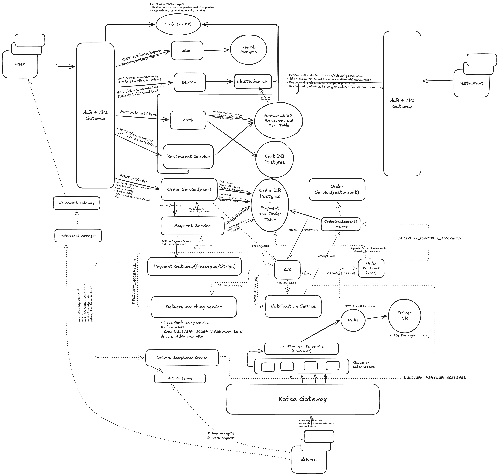

# Design a Food Deliver App - Zomato / Swiggy

## functional requirements

- user should be able to signup and login
- user should be able to see nearby restaurants from their current location
- user should be able to search for a particular restaurant/dish by name
- user should be able to see the entire menu of the restaurant it selected
- user should be able to select multiple items to add to cart and place order
- once restaurant accepts order, find nearby delivery partner based on partner location and optimised delivery time
- once delivery partner picks up order, show almost real-time location of partner to user
- user should be notified of all stages of an order (accepted, preparing order, picked, on-the-way, arrived, delivered)
- user should be able to see all their past orders

## non functional requirements

- Scale: 50M users, 1M restaurants
- CAP theorem: search and browsing should be highly available, payment and placing order should be highly consistent

## Core Entity

- User
- Restaurant
- Food Menu
- Delivery Agent
- Payment

## API creation

1. POST /v1/users/signup and /v1/users/login -> response jwt/session
2. GET /v1/restaurants/nearby?lat={lat}&lon={lon}&rad={rad} -> Paginated list of restaurants ids and partial metadata
3. GET /v1/restaurants/search?title={title}&item={item} -> Paginated list of restaurants ids and partial metadata
4. GET /v1/restaurants/:id -> Restaurant Metadata
5. GET /v1/restaurants/:id/menu -> List of dishes available
6. PUT /v1/cart/items -> body: {rest_id, items: [{item_id, qty}]} (replaceable cart) -> return cart_id
7. POST /v1/order -> body: {cart_id} -> return order_id (status = 'PENDING')
8. PUT /v1/payments -> {order_id, payment_details} -> returns payment_id
9. GET /v1/delivery/:order_id/tracking -> returns tracking metadata with status

## Deep Dive

### Choice of DB

- User DB (Postgres)
  - User Table: id, name, email, contact_no, hashed_pwd, address, ...metadata
- Search Service -> ElasticSearch
- Restaurant DB: Postgres
  - Restaurant Table: (id, name, address, status (OPEN/CLOSED), geolocation(lat+lang), image_urls, ...metadata)
  - Menu Table: (id, restaurant_id, dish_id, title, description, image_urls, category, price, ...metadata)
- Cart DB: Postgres
  - Cart Table: (id, rest_id, user_id, dish_ids)
- Order DB:
  - Payment table: id, user_id, order_id, gateway_ref, amount, currency, status (SUCCESS/FAIL/IN_PROGRESS), ...metadata
  - Order Table: order_id, user_id, restaurant_id, dish_ids, price, currency, status, driver_id ...metadata

On successful payment -> ack sent back to order service -> trigger ORDER_PLACED event to SNS topic:

- Booking consumer updates status of Order DB
- Notification service consumer to notify user
- Restaurant consumer to notify the Restaurant Order Service to accept the order

On restaurant acceptance, Restaurant order service sends out a ORDER_ACCEPTED event:

- Booking Consumer updates status of order DB
- Notification consumer takes that and sends info back to user
- Delivery Partner consumer assigns a delivery partner -> DELIVERY_PARTNER_ASSIGNED event gets triggered -> order consumer updates Booking DB order table to status to DELIVERY_PARTNER_ASSIGNED

## How delivery matching service finds an assigns a partner

- Use GeoHashing(proximity search) to assign ideal driver
- Drivers update their location to every 5-10 seconds -> we put a kafka gateway(Since regular LB + API Gateway not sufficient) which sits infront of a cluster of kafka brokers with the sole purpose that they send their location to a `Location Service` which now acts as a consumer to the kafka broker cluster
- The location service implements a write-through caching(Redis) to update the driver location: TTL(10 seconds - for offline drivers)
- Delivery Matching service also reaches out to this Redis Cache instead of Driver DB



## Deep Dive (walkthrough)

### 0. The 30-second pitch

> "Users browse and search restaurants through **ElasticSearch**, which is kept in sync with the **Postgres** Restaurant DB using **CDC**. Images are served from **S3 behind a CDN**. The user builds a cart, places an order and pays through **Razorpay/Stripe**; the order and payment live in one **Postgres Order DB** so they stay strongly consistent. Once payment succeeds, every later step is an event on **SNS** (`ORDER_PLACED`, `ORDER_ACCEPTED`, `DELIVERY_PARTNER_ASSIGNED`), and each consumer (order status, notifications, restaurant, delivery matching) reacts on its own. Drivers stream their location every 5–10 seconds through a **Kafka gateway** into **Redis with a TTL**. The **delivery matching service** uses **geohashing** on Redis to find nearby drivers and offers them the order; the first driver to accept wins through an **atomic conditional update**. Users get live tracking and status updates over **WebSockets**."

---

### 1. Flow 1: Browse, search and view a restaurant

`GET /v1/restaurants/nearby?lat..&lon..&rad..` · `GET /v1/restaurants/search?title..&item..` · `GET /v1/restaurants/:id` · `GET /v1/restaurants/:id/menu`

```
User → ALB + API Gateway
   ├─→ Search Service     → ElasticSearch       → nearby (geo_distance query) / search by name or dish
   ├─→ Restaurant Service → Restaurant DB       → restaurant metadata + full menu
   └─→ S3 (with CDN)                            → restaurant and dish images

Restaurant DB (Postgres) ──CDC──→ ElasticSearch   (menu/status changes flow into the index)

Restaurant app → its own ALB + API Gateway → Restaurant Service → Restaurant DB
   (add/update/delete menu, open/close, admin add/remove restaurants)
```

- **Key point:** reads go to ElasticSearch, writes go to Postgres. CDC connects the two, so the search index is eventually consistent. That's fine for browsing (the non-functional requirements say browsing should be highly available).
- **Why ElasticSearch?** It does full-text search (fuzzy match on "biryani" or a restaurant name) and geo queries (`geo_point` + `geo_distance`) in one place. Each indexed document holds the restaurant plus its dish titles, so one query answers "restaurants near me that serve X".
- **Why CDC instead of writing to both?** A dual write from the Restaurant Service can half-fail and leave the index out of sync. CDC (for example Debezium on the Postgres WAL) reads the committed changes and replays them into the index.
- **Why S3 + CDN?** Images are large and read far more than written. The CDN serves them close to the user; the DB stores only `image_urls`.
- **Pagination:** nearby and search both return paginated ids plus partial metadata (name, rating, image, ETA). The full menu is fetched only when a restaurant is opened.
- **Caching:** menus change rarely and are read a lot, so `GET /:id/menu` can be cached (Redis or CDN) and invalidated when the restaurant edits its menu.

---

### 2. Flow 2: Cart

`PUT /v1/cart/items {rest_id, items: [{item_id, qty}]}` → `cart_id`

```
User → API GW → Cart Service
   1. Read Restaurant DB → is the restaurant OPEN? are these items on the menu and available?
   2. Upsert Cart DB (one active cart per user, for one restaurant)
← cart_id
```

- **Key point:** the cart is **replaceable**. Each `PUT` sends the full item list, so retries are safe (idempotent) and the client never has to send diffs.
- **One restaurant per cart:** if the user adds from a different restaurant, the old cart is replaced (the "start a new cart?" prompt in the app).
- **Cart record:** id, rest_id, user_id, items (dish_id + qty). Storing qty with each dish is needed, since the API sends it.
- **Prices aren't trusted from the cart.** The price is re-read from the Menu table when the order is created, so a stale cart can't lock in an old price.

---

### 3. Flow 3: Place order and pay

`POST /v1/order {cart_id}` → `order_id` · `PUT /v1/payments {order_id, payment_details}` → `payment_id`

```
User → API GW → Order Service (user)
   1. Validate: restaurant OPEN and accepting orders, cart not empty,
      items available, delivery address within the allowed radius
   2. Read current prices from the Menu table, compute the total
   3. INSERT Order (status = PENDING_PAYMENT)
← order_id

User → PUT /v1/payments → Payment Service
   1. Check the order is still PENDING_PAYMENT
   2. INSERT Payment (status = IN_PROGRESS)
   3. Create a Payment Intent at the Payment Gateway (Razorpay/Stripe) → ref_id, redirect_url
   4. User completes payment on the gateway
   5. Gateway webhook (success/failure) → Payment Service
        ├─ SUCCESS → Payment = SUCCESS → ack Order Service → Order = ORDER_PLACED
        │            → publish ORDER_PLACED to SNS
        └─ FAIL    → Payment = FAIL    → order stays PENDING_PAYMENT (user can retry) or expires
```

- **Key point:** order and payment tables sit in the **same Postgres Order DB**, so "payment SUCCESS + order ORDER_PLACED" can be one transaction. This is the part that must be strongly consistent.
- **Idempotency:** use `order_id` as the idempotency key with the gateway, and dedupe webhooks by `gateway_ref`. A retried request or a repeated webhook never charges twice or places the order twice.
- **Don't trust the redirect.** The client coming back from the gateway is not proof of payment; only the signed webhook (or a server-side status check) is.
- **Missing webhook:** a background job polls the gateway for payments stuck in IN_PROGRESS, and unpaid PENDING_PAYMENT orders expire after a timeout.
- **Publishing the event safely (transactional outbox):** write the `ORDER_PLACED` event to an outbox table in the same transaction as the status change; a relay publishes it to SNS. This avoids "DB updated but event lost" (or the reverse).
- **Order record:** order_id, user_id, restaurant_id, items (dish_id, qty, price), total, currency, status, driver_id, ...metadata
- **Payment record:** id, user_id, order_id, gateway_ref, amount, currency, status (IN_PROGRESS/SUCCESS/FAIL), ...metadata

---

### 4. Flow 4: Order events and restaurant acceptance

```
ORDER_PLACED → SNS
   ├─→ Order Consumer (user)      → Order DB status = ORDER_PLACED
   ├─→ Notification Service       → push to user ("order placed")
   └─→ Order (restaurant) consumer → Order Service (restaurant) → shows the order on the restaurant app

Restaurant app → accept/reject → Order Service (restaurant)
   ├─ ACCEPT → publish ORDER_ACCEPTED → SNS
   │     ├─→ Order Consumer        → status = ORDER_ACCEPTED
   │     ├─→ Notification Service  → push to user
   │     └─→ Delivery Matching Service → start finding a partner (Flow 6)
   └─ REJECT → publish ORDER_REJECTED → status = REJECTED → refund via Payment Service → notify user

Restaurant app → status updates (PREPARING, READY_FOR_PICKUP) → same event path
```

- **Key point:** after payment, each step is an event. Services don't call each other directly, so a slow Notification Service can't block order acceptance.
- **Why SNS (+ SQS)?** SNS fans one event out to many consumers. Putting an SQS queue behind each subscriber gives retries, a dead-letter queue, and lets each consumer scale on its own.
- **Consumers must be idempotent.** Delivery is at-least-once, so the same event can arrive twice. Status updates should be conditional, e.g. `UPDATE orders SET status='ORDER_ACCEPTED' WHERE order_id=? AND status='ORDER_PLACED'`, so a duplicate or out-of-order event can't move the order backwards.
- **Restaurant doesn't respond:** a timeout (for example 5 minutes) auto-rejects the order and triggers a refund.
- **Order status lifecycle:** `PENDING_PAYMENT → ORDER_PLACED → ORDER_ACCEPTED → PREPARING → DELIVERY_PARTNER_ASSIGNED → PICKED_UP → ON_THE_WAY → ARRIVED → DELIVERED` (or `REJECTED` / `CANCELLED`)

---

### 5. Flow 5: Driver location updates (always running)

```
Driver app ──(every ~5–10s)──→ Kafka Gateway → Kafka brokers (topic: driver-location, keyed by driver_id)
                                                  └─→ Location Update Service (consumer group)
                                                         ├─→ Redis : GEOADD live location + key with TTL
                                                         └─→ Driver DB : status and last known location
```

- **Why a Kafka gateway instead of the normal API Gateway?** Thousands to millions of small writes every few seconds. Kafka absorbs the burst, buffers it if consumers fall behind, and lets the Location Update Service scale by adding partitions and consumers.
- **Why key by driver_id?** All updates from one driver land in the same partition, so they're processed in order and an old location never overwrites a newer one.
- **Why a TTL in Redis?** If a driver goes offline or the app dies, their key expires and they drop out of matching. The TTL should be a bit longer than the ping interval (for example 2–3 pings, about 20–30s); with 10s pings and a 10s TTL, a slightly late ping would make an online driver vanish.
- **Write-through, with care:** Redis is the source of truth for the live location, and the Delivery Matching Service reads only Redis. Writing every single ping through to Driver DB would overload Postgres, so the DB write can be batched or sampled (for example the last location every 30s, plus every status change). Kafka also keeps the raw stream if route history is needed.
- **Driver DB (Postgres):** Driver table: driver_id, name, contact_no, vehicle_no, status (OFFLINE/AVAILABLE/ON_DELIVERY), rating, last_lat, last_long, modified_ts, ...metadata

---

### 6. Flow 6: Delivery matching and assignment (the core deep dive)

Triggered by `ORDER_ACCEPTED`. The driver replies with `POST /v1/delivery/:order_id/accept`.

```
ORDER_ACCEPTED → SNS → Delivery Matching Service
  1. Look up the restaurant's lat/long (the pickup point) → geohash (e.g. "tdr1y")
  2. Redis GEOSEARCH: drivers in that cell + its 8 neighbours (widen the radius if too few)
  3. Filter: status = AVAILABLE, key not expired (online)
  4. Rank: distance/ETA to the restaurant vs. the food's ready time, rating
  5. Publish DELIVERY_ACCEPTANCE for the top-K drivers
        → Delivery Acceptance consumer → WebSocket Manager → push to those drivers
          (FCM/APNs if the app is in the background)
  6. Drivers reply: API Gateway → Delivery Acceptance Service
        → atomically claim the order (see race condition below)
             ├─ WON  → order.driver_id = driver, driver.status = ON_DELIVERY
             │         → publish DELIVERY_PARTNER_ASSIGNED → SNS
             │              ├─→ Order Consumer       → status = DELIVERY_PARTNER_ASSIGNED
             │              ├─→ Notification Service → tell the user and the restaurant
             │              └─→ cancel the offer on the other drivers' apps
             └─ LOST → "order already taken"
  7. Nobody accepts within ~30–60s → next batch of drivers / bigger radius → retry
```

#### Geohashing in one line

A geohash turns a lat/long into a string; a longer string is a smaller cell, and a shared prefix means the points are close. Always search the **neighbouring cells** too, because a driver just across a cell edge can be very close. *(Redis does this natively with `GEOADD` / `GEOSEARCH`.)*

#### When to start matching

- Matching starts on `ORDER_ACCEPTED`, not when the order is placed, so drivers aren't sent to a restaurant that may reject.
- The goal is for the driver to arrive **when the food is ready**, not as early as possible. If prep time is 20 minutes and the nearest driver is 5 minutes away, matching can wait or rank by "ETA close to ready time". This is the "optimised delivery time" in the requirements.

#### The race condition (a very common interview question)

- **Problem 1: many drivers accept the same order.** The offer goes to K drivers at once, so two of them can tap "accept" at the same moment. Without protection both think they got it.
- **Solution: first write wins, done atomically.**
  - In Postgres: `UPDATE orders SET driver_id = :d, status = 'DELIVERY_PARTNER_ASSIGNED' WHERE order_id = :o AND driver_id IS NULL`. Only one update can match the row; the one that changes 1 row wins, everyone else sees 0 rows and gets "already taken".
  - Or in Redis in front of it: `SET order:{id}:driver {driver_id} NX EX 60`. Fast, then persisted to the Order DB.
- **Problem 2: one driver gets offers for several orders and accepts two.** Two nearby orders both pick the same driver.
- **Solution: a lock per driver too.** In the same claim step, set the driver `AVAILABLE → ON_DELIVERY` with a conditional update (or `SET driver:{id} NX EX ..`). If the driver is no longer AVAILABLE, the claim fails. (Batching two orders from the same restaurant to one driver is a later, deliberate feature, not an accident.)
- **Offer, not broadcast, at scale:** sending to all drivers in range causes a thundering herd and lots of "already taken". Sending to a small top-K, then the next batch, keeps it fair and cheap.

#### CAP mapping (say this explicitly)

- **Assignment needs consistency:** one order must have exactly one driver, and one driver shouldn't be double-booked. That's why the claim is an atomic conditional write.
- **Location and browsing need availability:** a driver location that is a few seconds old, or a search index a second behind, is fine. Redis and ElasticSearch favour availability and speed.
- **Order + payment need consistency:** handled with Postgres transactions and idempotency keys (Flow 3).

---

### 7. Flow 7: Live tracking and notifications

`GET /v1/delivery/:order_id/tracking` (initial state) + WebSocket for live updates

```
Driver location → Kafka → Location Update Service
   → if driver is ON_DELIVERY: look up the order → push location to WebSocket Manager
        → WebSocket gateway → the user tracking that order

Order status events (SNS) → Notification Service
   ├─→ WebSocket Manager → user's open app (instant status change)
   └─→ FCM/APNs/SMS      → user's app in background

Driver app → PICKED_UP / ON_THE_WAY / ARRIVED / DELIVERED → same event path → Order DB status
```

- **Key point:** `GET /tracking` returns the current status and last location when the screen opens; after that the server pushes updates, so the client doesn't poll.
- **WebSocket Manager:** keeps a map of `user_id/driver_id → which gateway server holds the connection` (in Redis). Any service can push to a user by asking the manager, without knowing which server they're connected to.
- **Why WebSockets?** Near real-time location every few seconds to many users. Polling would multiply load; a persistent connection lets the server push.
- **Only track after pickup (or assignment).** Live location is pushed only for active orders, which keeps the fan-out small compared to the full driver stream.
- **Past orders:** `GET` order history reads the Order DB by `user_id` (index on user_id, created_at).

---

### Data stores at a glance

| Store | Tech | Holds | Why |
|---|---|---|---|
| User DB | Postgres | Users, hashed passwords, addresses | Relational, low write rate |
| Restaurant DB | Postgres | Restaurants, menus, prices, open/closed | Source of truth; feeds search via CDC |
| Search index | ElasticSearch | Denormalised restaurant + dish docs with geo_point | Full-text + geo search, highly available reads |
| Media | S3 + CDN | Restaurant and dish images | Large blobs, cached close to users |
| Cart DB | Postgres | Active cart per user | Simple; could also be Redis with a TTL |
| Order DB | Postgres | Orders and payments | ACID: payment and order status change together |
| Live locations | Redis (geo + TTL) | Current driver positions | Very frequent writes, fast geo queries, auto-expiry |
| Driver DB | Postgres | Driver profile, status, rating, last location | Durable driver data |
| Location stream | Kafka | Raw driver pings | Absorbs bursts, ordered per driver, replayable |
| Event bus | SNS (+ SQS) | ORDER_PLACED, ORDER_ACCEPTED, DELIVERY_PARTNER_ASSIGNED, ... | Fan-out to independent consumers with retries |

---

### Quick-fire answers to likely follow-ups

- **"What if two drivers accept the same order?"** The claim is a conditional update (`WHERE driver_id IS NULL`) or a Redis `SET NX`. Only one succeeds; the others are told it's taken.
- **"What if no driver accepts?"** Retry with the next batch and a wider radius. After a limit, alert ops or offer the user a cancel with refund.
- **"What if the restaurant rejects or never responds?"** `ORDER_REJECTED` (or a timeout) → refund through the Payment Service → notify the user.
- **"What if the payment webhook never arrives?"** A reconciliation job polls the gateway for IN_PROGRESS payments; unpaid orders expire.
- **"How do you avoid charging twice?"** `order_id` as the idempotency key with the gateway, and webhooks deduped by `gateway_ref`.
- **"Why not put driver locations straight in Postgres?"** Too many writes. Redis holds the live position; the DB gets batched snapshots and status changes.
- **"Search shows a dish that just went out of stock?"** ES is eventually consistent via CDC. The cart and order services re-check availability in the Restaurant DB, so it can't be ordered.
- **"Price changed between cart and checkout?"** The Order Service re-reads prices at order time and shows the final total before payment.
- **"Hot areas, like a busy food court at dinner?"** Use a finer geohash precision there, offer to smaller batches, and add surge/delivery fees to balance demand.
- **"How does the user get status updates?"** SNS event → Notification Service → WebSocket if the app is open, push notification (FCM/APNs) if not.
