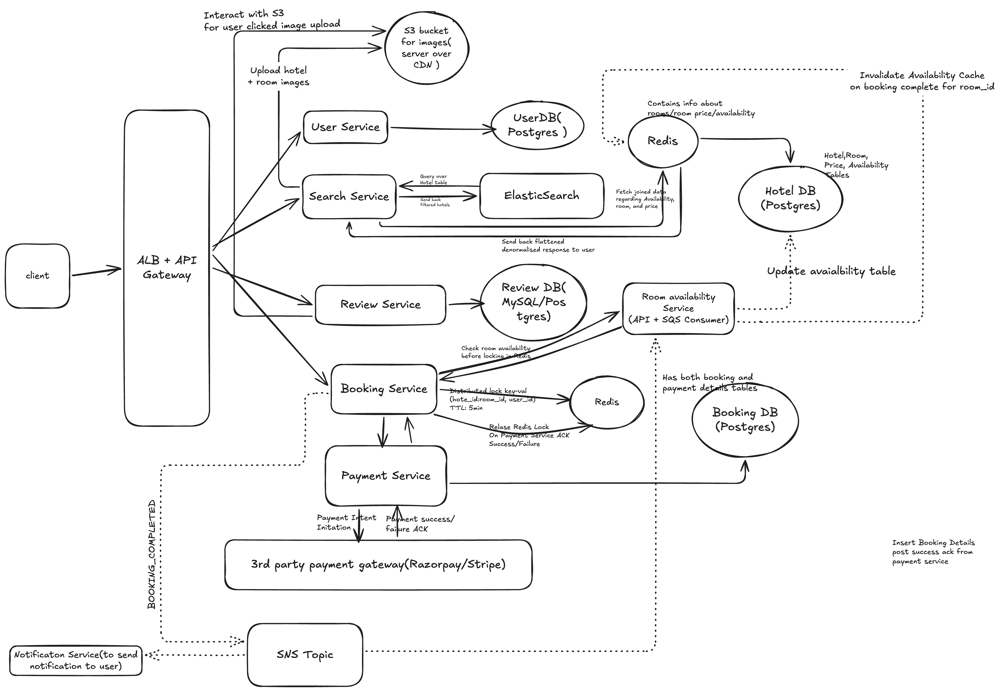
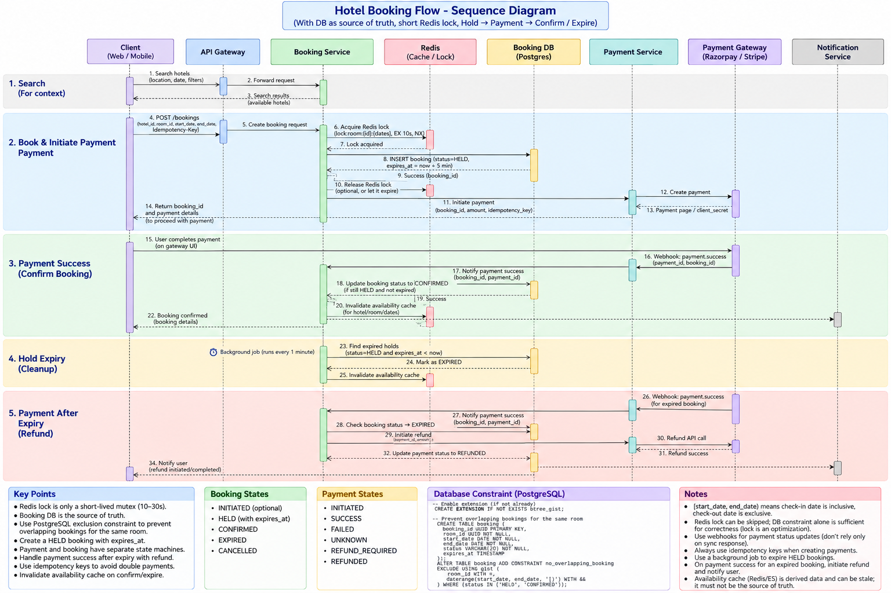

# Design a Hotel Booking System - MMT, bookin.com etc

## functional requirements

- user should be able to login
- user should be able to search hotels via location, name, plus additional filters
- user should be able to see hotel details including pictures, reviews, location-on-map, and info regarding avaialble rooms on particular dates for that hotel
- for available rooms, user should be able to book room and make payment
- user should be able to view past and existing bookings

## non functional requirements

- scale: 50 M users, 1M hotels
- CAP theorem: booking service consistent(no 2 users should be able to book the same room), searching should be highly available

## Core Entities

- User
- Hotel
- Hotel Rooms
- Booking

## API Design

- POST /v1/auth/register -> body: {name, email, password, ...otherMetadata like contact_no}
- POST /v1/auth/login -> body: {username, password} -> Response JWT/Session (passed onto every subsequent request)
- GET /v1/hotels/search?q={searchTerm}&l={location}&d={date} -> Response Paginated List<Hotel metadata partial>
- GET /v1/hotels/{hotel_id}/{date} -> Response Hotel metadata for the provided date including price for the provided date
- POST /v1/booking -> body {hotel_id, start_date, end_date, room_id} + header `Idempotency-Key` -> response {booking_id, redirect_url / client_secret}
- GET /v1/bookings -> Paginated list of all bookings for the user(booking_id, date, amount_paid)

## HLD Deep Dive

### Choice of DB

- User Service -> Postgres
  - User Table(Name, email_id, hashed_pwd, contact_no, ...metadata)
- Hotel DB -> Postgres
  - Hotel Table: (id, title, geolocation, address, image_urls) -> Image saved to S3 (served over CDN)
  - Room Table: (id, hotel_id, type, capacity, ...metadata)
  - Price Table: (id, hotel_id, room_id, start_date, end_date, currency)
  - Availability: (id, hotel_id, start_date, end_date, status)
- Review DB - Postgres/MySQL
  - Review table(hotel_id, user_id, review, comments, image_urls(one's uploaded by user - saved to S3))
- Booking DB -> Postgres (source of truth for room holds)
  - Booking Table: (booking_id, user_id, hotel_id, room_id, start_date, end_date, amount, currency, status, expires_at, idempotency_key, created_at, updated_at)
    - `status`: `INITIATED` | `HELD` | `CONFIRMED` | `EXPIRED` | `CANCELLED`
    - `expires_at`: set only when `status = HELD` (typically `now + 5 min`)
    - exclusion constraint to prevent overlapping bookings for the same room:
      ```sql
      EXCLUDE USING gist (
        room_id WITH =,
        daterange(start_date, end_date, '[)') WITH &&
      ) WHERE (status IN ('HELD', 'CONFIRMED'));
      ```
  - Payment Table: (id, booking_id, payment_gateway_ref, idempotency_key, status, amount, refund_id, created_at, updated_at)
    - `status`: `INITIATED` | `SUCCESS` | `FAILED` | `UNKNOWN` | `REFUND_REQUIRED` | `REFUNDED`

### Search Crterion

- We can only search for a hotel using either its name (which is very simple since ES is optimised for textual search)
- We can search for hotels using its location (lat + lang) and date - This is known as proximity search. Eg: search for hotels available for this date within 5kms radius of this location
- Available best options for proximity search:
  - Elastic search - **Best option since none of the other options support textual search which is very critical to our requirements**
  - Quad Tree (Tree based data structure recursively dividing entire world map into quadrants/subquadrants)
  - postgres + GIS extension (way of indexing geolocation)
  - GeoHash (Similar to quadtree but more efficient)

### Search optimisation

Since ElasticSearch would ingest data from a relational postgres DB with multiple tables involving multiple joins, we need to optimise our search crtieria very efficiently. A simple solution is a 2 step search response:

- Step 1: ElasticSearch would loop over hotel table, since that has the data for search criteria regarding name and geolocation
- Step 2: From result of above elasticSearch result (significantly filtered out from total 1M records) - we can do SQL join in our search service and send result back to user - or we can put a cache on top of it

### Booking redis lock & payment flow

Redis lock is a **short-lived mutex (10–30s)** — it only protects the DB insert. The 5-minute payment window is enforced by `expires_at` in Postgres (DB + exclusion constraint is the source of truth).

#### Per-night lock granularity (yes, keep this)

**One lock key per night**, not one key for the whole date range. This prevents partial overlaps between different users.

```
Booking: room_101, check-in Jan 1, check-out Jan 5  →  [start_date, end_date) = 4 nights

Lock keys acquired:
  lock:room:101:night:2026-01-01
  lock:room:101:night:2026-01-02
  lock:room:101:night:2026-01-03
  lock:room:101:night:2026-01-04
  (check-out date Jan 5 is exclusive — guest does not occupy that night)
```

| User A books | User B tries | Result |
|--------------|--------------|--------|
| Jan 1 → Jan 5 | Jan 3 → Jan 6 | **Conflict** on nights Jan 3, Jan 4 |
| Jan 1 → Jan 5 | Jan 5 → Jan 7 | **No conflict** — A's last night is Jan 4 |

All night keys for a booking must be acquired **atomically** (all-or-nothing) via a Lua script — otherwise two concurrent requests could each grab different subsets of nights and both proceed.

```
acquire_redis_lock(room_id, start_date, end_date)
  -> derive night keys: [start_date, end_date) — one key per night
  -> EVAL acquire_night_locks.lua  (atomic multi-key SET NX)
  -> on failure: return 409 (room unavailable for these dates)
```

**Acquire script** — tries `SET NX EX` on every night key; rolls back on first failure:

```lua
-- KEYS[1..N] = lock:room:{room_id}:night:{YYYY-MM-DD}  (one per night)
-- ARGV[1] = booking_id (lock owner token)
-- ARGV[2] = TTL in seconds (e.g. 10)

local booking_id = ARGV[1]
local ttl        = tonumber(ARGV[2])

for i, key in ipairs(KEYS) do
  if redis.call('SET', key, booking_id, 'EX', ttl, 'NX') == false then
    -- rollback: release any nights we already grabbed in this attempt
    for j = 1, i - 1 do
      redis.call('DEL', KEYS[j])
    end
    return 0  -- conflict — at least one night already locked
  end
end

return 1  -- all nights locked successfully
```

**Release script** — only deletes keys still owned by this `booking_id` (safe even if TTL already expired):

```lua
-- KEYS[1..N] = same night keys passed at acquire time
-- ARGV[1]    = booking_id

local booking_id = ARGV[1]

for i, key in ipairs(KEYS) do
  if redis.call('GET', key) == booking_id then
    redis.call('DEL', key)
  end
end

return 1
```

Example call from booking service (Jan 1 → Jan 5, 4 nights):

```
EVALSHA acquire_night_locks 4 \
  lock:room:101:night:2026-01-01 \
  lock:room:101:night:2026-01-02 \
  lock:room:101:night:2026-01-03 \
  lock:room:101:night:2026-01-04 \
  booking_id ttl_seconds
```

Redis lock = fast-path optimization to reduce DB contention. Postgres exclusion constraint remains the final correctness guarantee if a lock is missed or expires mid-insert.

#### 1. Book & initiate payment (happy path start)

```
POST /bookings {hotel_id, room_id, start_date, end_date} + Idempotency-Key
  -> acquire_redis_lock(room_id, start_date, end_date) [all nights, TTL ~10–30s, via Lua]
  -> INSERT booking (status = 'HELD', expires_at = now + 5min)
  -> release_redis_lock(room_id, start_date, end_date) [via Lua — compare booking_id before DEL]
  -> initiate_payment(booking_service -> payment_service -> payment_gateway)
  -> return {booking_id, redirect_url / client_secret}
```

#### 2. Payment success → confirm booking

```
user completes payment on gateway UI
  -> payment_gateway sends webhook (payment.success) -> payment_service -> booking_service
  -> UPDATE booking SET status = 'CONFIRMED'
       WHERE booking_id = ? AND status = 'HELD' AND expires_at > now()   [conditional — avoids race with expiry worker]
  -> UPDATE payment SET status = 'SUCCESS'
  -> invalidate availability cache (async) for hotel/room/dates
  -> notify user (booking confirmed)
```

#### 3. Hold expiry (background worker — every 1 min)

```
worker runs every 1 min
  -> SELECT * FROM booking WHERE status = 'HELD' AND expires_at <= now()
  -> UPDATE booking SET status = 'EXPIRED'
  -> invalidate availability cache for affected hotel/room/dates
```

#### 4. Late payment after expiry → refund

```
payment_gateway sends webhook (payment.success) after hold already expired
  -> payment_service -> booking_service
  -> check booking status in DB:
       HELD     -> confirm (race with worker — use conditional update from step 2)
       CONFIRMED -> idempotent ack, no action
       EXPIRED  -> initiate refund (booking_service -> payment_service -> payment_gateway)
  -> on refund webhook success -> UPDATE payment SET status = 'REFUNDED'
  -> notify user (refund initiated/completed)
```

#### State reference

| Booking status | Meaning |
|----------------|---------|
| `HELD` | Room reserved, payment pending (`expires_at` set) |
| `CONFIRMED` | Payment succeeded, room booked |
| `EXPIRED` | Hold timed out, room released |
| `CANCELLED` | User/system cancelled |

| Payment status | Meaning |
|----------------|---------|
| `INITIATED` | Payment intent created |
| `SUCCESS` | Payment captured |
| `REFUND_REQUIRED` | Late payment on expired hold |
| `REFUNDED` | Refund completed |




