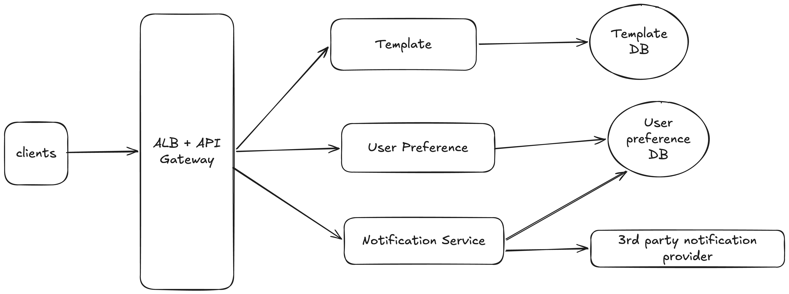
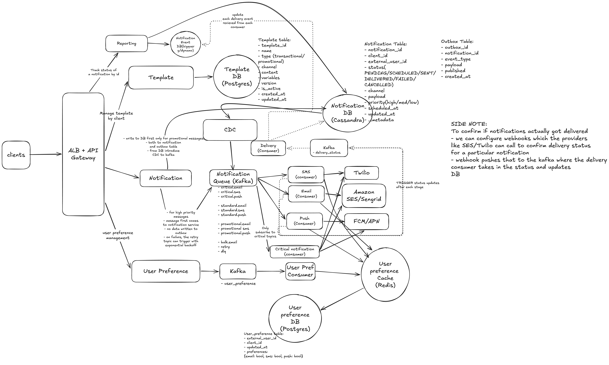

# Design distributed notification system

- Supports email, SMS, or in-app (FCM/APN)
- 2 types: scheduled/real-time notifications

## functional requirements

- Support multiple delivery channels (SMS, email, in-app via FCM/APN)
- Create, update and manage notification templates with dynamic content
- Allow users to configure notification templates per channel and type
- Support immediate, and scheduled notifications
- Track delivery status (Reporting)

## non functional requirements

- Scale: 1M notifications/min
- CAP theorem: Availability >> consistency
- Latency: Near real-time for OTP (or other instant notifications), 5-10s for promotional notifications

## Core Entity

- User(person using the 3rd party app) + Client(3rd party apps/enterprises using our app)
- Notification Preference
- Notification Content
- Template
- Delivery status

## API Design

- POST /v1/notifications - payload {template_id, recipient_id, variables, channels?, priority?, scheduled_at?} -> response notification_id
- GET /v1/notifications/:notification_id/status

TEMPLATE ENDPOINTS

- POST /v1/templates - create new template
- GET /v1/templates/:template_id/:version_id
- ...CRUD endpoints to update/delete templates

USER PREFERENCE ENDPOINTS

- PUT /v1/preferences -> payload {external_user_id, client_id(uber/flipkart), preferences: {email: true, sms: false, push: true}}

## HLD



```
clients → ALB + API Gateway ─┬─→ Template Service        → Template DB
                             ├─→ User Preference Service → User Preference DB
                             └─→ Notification Service    ─┬─→ User Preference DB   (read: which channels is the user opted into?)
                                                          └─→ 3rd-party notification provider (Twilio / SES / FCM / APN)
```

- Three services, one per core entity: **Template**, **User Preference** and **Notification**.
- The Notification Service checks the user's preferences before it sends anything, then hands the message to an external provider. We never deliver SMS, email or push ourselves.
- This version is synchronous and has no queue, so it can't handle 1M/min, priorities, retries or delivery tracking. The deep dive fixes that.

## Deep Dive



### 0. The 30-second pitch

> "Clients (Uber, Flipkart...) call our API through an **ALB + API Gateway**. **Templates** live in **Postgres** and **user preferences** live in **Postgres**, cached in **Redis** so the send path never hits the DB. When a client sends a notification, the **Notification Service** routes it by priority. **Critical** messages (OTP) go straight to **Kafka** for the lowest latency. **Promotional/standard** messages are first written to **Cassandra** (notification + outbox tables), and **CDC** moves them to Kafka, so none are lost. Kafka has **topics per priority × channel** (`critical.sms`, `promotional.email`...), plus `bulk`, `retry` and `dlq`. **Channel consumers** (SMS, Email, Push) and a dedicated **Critical consumer** check preferences in Redis and call **Twilio / SES / FCM / APN**. Every stage, plus provider **webhooks**, emits to a `delivery_status` topic. A **Delivery consumer** updates Cassandra and an event store that the **Reporting** service reads. We choose **availability over consistency**: a duplicate promo is acceptable, a lost OTP is not."

---

### 1. Flow 1: Template management

```
Client → API GW → Template Service → Template DB (Postgres)
         ("manage template by client")
```

#### Template table (Postgres)

`template_id, name, type (transactional/promotional), channel, content, variables, version, is_active, created_at, updated_at`

- **Why Postgres?** Templates are few, relational, read-heavy and rarely written. Versioning and `is_active` flags need consistent updates.
- **Versioning:** `GET /v1/templates/:template_id/:version_id`. An edit creates a new version instead of overwriting, so notifications already queued with the old version still render correctly.
- `content` holds placeholders (`Hi {{name}}, your OTP is {{otp}}`). `variables` lists the expected keys, so the API can reject a send request that's missing a variable.

---

### 2. Flow 2: User preference management

```
Client → API GW → User Preference Service → Kafka topic: user_preference
                                                  │
                                                  ▼
                                         User Pref Consumer
                                                  │
                                                  ▼
                                   User Preference Cache (Redis) ──→ User Preference DB (Postgres)
```

#### User_preference table (Postgres)

`external_user_id, client_id, updated_at, preferences: {email: bool, sms: bool, push: bool}`

- **Key = (`client_id`, `external_user_id`).** The user belongs to the client (Uber's user 123 is not Flipkart's user 123), so preferences are scoped per client.
- **Why Kafka in front?** Preference updates are bursty (for example, a client bulk-imports users). Kafka absorbs the bursts and lets the consumer write at its own pace.
- **Why Redis?** Every one of the ~16.7k notifications/sec (1M/min) needs a preference lookup. Redis serves that in under a millisecond, and Postgres would become the bottleneck.
- **Cache → DB arrow:** the consumer updates Redis first and the change is persisted to Postgres (write-behind). Postgres is the source of truth for rebuilding the cache.
  - _Consideration:_ write-behind can lose an update if Redis dies before it persists. The safer option is to **write Postgres first, then update/invalidate Redis** (write-through). The cost is a little more latency on a path that isn't latency-sensitive anyway.
- An opt-out takes effect in seconds, not instantly. That's an accepted AP trade-off.

---

### 3. Flow 3: Sending a notification (the core deep dive)

`POST /v1/notifications {template_id, recipient_id, variables, channels?, priority?, scheduled_at?}` → returns `notification_id`

The Notification Service validates the request, renders the template into `payload`, and **routes by priority**:

#### 3a. Promotional / standard path (durability first: outbox + CDC)

```
Client → API GW → Notification Service
                        │  single write: Notification table + Outbox table
                        ▼
                Notification DB (Cassandra)
                        │
                        ▼
                       CDC  (reads outbox rows, publishes, marks published = true)
                        │
                        ▼
              Notification Queue (Kafka) → standard.* / promotional.* / bulk.email
```

- **Why the outbox pattern?** If the service writes the DB and then publishes to Kafka separately (dual write), a crash between the two steps leaves a notification saved but never sent, or sent but never recorded. Writing both rows together and letting **CDC** publish means a row in the DB is always eventually published.
- **Why only for promotional/standard?** The extra DB write and the CDC hop add latency (hundreds of ms to seconds). That's fine within the **5–10s** promotional budget, and too slow for an OTP.
- Scheduled notifications (`scheduled_at` set) are stored with status `SCHEDULED` and released at the right time (see follow-ups).

#### 3b. Critical / high-priority path (latency first)

```
Client → API GW → Notification Service ──direct publish──→ Kafka: critical.email / critical.sms / critical.push
                         │
                         └── on failure → retry topic (exponential backoff) → dlq after N attempts
```

- The message goes **straight to Kafka**, with **no outbox write**, because the OTP has to arrive in near real time.
- If the publish or delivery fails, the **retry** topic re-attempts with **exponential backoff**. After the maximum attempts, it goes to the **dlq** for inspection.
- _Trade-off:_ there's a tiny window where a critical message can be lost (for example, the service crashes before Kafka acks). That's acceptable because an OTP is short-lived and the user can tap "resend". Use `acks=all` on the producer to make that window small.

#### Notification table (Cassandra)

`notification_id, client_id, external_user_id, status (PENDING/SCHEDULED/SENT/DELIVERED/FAILED/CANCELLED), channel, payload, priority (high/med/low), scheduled_at, updated_at, ...metadata`

**Status lifecycle:** `PENDING | SCHEDULED → SENT → DELIVERED | FAILED` (`CANCELLED` is possible while PENDING or SCHEDULED)

#### Outbox table (Cassandra)

`outbox_id, notification_id, event_type, payload, published, created_at`

- **Why Cassandra?** It's write-heavy (1M/min plus status updates on each one), simple key-based lookups by `notification_id`, linear horizontal scaling, and tunable consistency that suits AP.
- _Consideration:_ Cassandra has no multi-table ACID transactions. Use a **logged batch** for the notification + outbox write, or put both in one partition. Another option is to use Cassandra's own CDC/commit log on the notification table directly, without a separate outbox table.

---

### 4. Flow 4: Kafka topics and consumers (fan-out to providers)

#### Topics (priority × channel)

| Priority    | Topics                                                              |
| ----------- | ------------------------------------------------------------------- |
| Critical    | `critical.email`, `critical.sms`, `critical.push`                   |
| Standard    | `standard.email`, `standard.sms`, `standard.push`                   |
| Promotional | `promotional.email`, `promotional.sms`, `promotional.push`          |
| Special     | `bulk.email` (mass campaigns), `retry` (backoff), `dlq` (dead letter) |

- **Why split by priority?** A 10M-user promotional campaign must never delay an OTP sitting behind it in the same partition. Separate topics mean separate lag, separate consumer scaling and separate provider rate-limit budgets.
- **Why split by channel?** Each channel has a different provider, throughput and rate limit. SMS is expensive and slow, push is cheap and fast. Each one scales on its own.
- **Why a separate `bulk.email`?** Huge campaigns are throttled differently and can be batched into provider bulk APIs.

#### Consumers

```
Notification Queue (Kafka)
   ├─→ SMS consumer    ──→ Twilio
   ├─→ Email consumer  ──→ Amazon SES / SendGrid
   ├─→ Push consumer   ──→ FCM / APN
   └─→ Critical notification consumer (subscribes ONLY to critical.* topics)
                        ──→ Twilio / SES / FCM-APN

Each consumer ──read──→ User Preference Cache (Redis)   (skip the channel if the user opted out)
```

- **Why a dedicated critical consumer?** It's an isolated, over-provisioned consumer group that never shares threads, connections or backpressure with promotional traffic, so OTP latency stays predictable even during a campaign spike.
- **Preference check at the consumer:** the latest preference is applied right before sending, so an opt-out made after enqueue is still honoured. Transactional messages like OTPs can bypass opt-out if policy allows.
- **Idempotency:** Kafka is at-least-once, so a consumer can process the same message twice. Use `notification_id` as a dedupe key (Redis `SETNX` with a TTL, or a status check) before calling the provider. Most providers also accept an idempotency key.
- **Partition key:** `external_user_id` (or `notification_id`), so one user's messages stay ordered and load spreads evenly.

---

### 5. Flow 5: Delivery status tracking (return path)

```
SMS / Email / Push / Critical consumers ┄┄ "TRIGGER status updates after each stage" ┄┄┐
                                                                                       ▼
Provider webhooks (Twilio / SES / FCM-APN callbacks) ─────────────────────→ Kafka topic: delivery_status
                                                                                       │
                                                                                       ▼
                                                                            Delivery consumer
                                                                              ├┄→ Notification DB (Cassandra) : update status
                                                                              └┄→ Notification Event DB (BigQuery/DynamoDB)
                                                                                     : append each delivery event
```

- **Two sources of status:**
  1. **Our consumers** emit an event at each stage (picked up, preference-skipped, sent to provider, provider error) → `SENT` / `FAILED`.
  2. **Provider webhooks** (side note in the diagram). A successful provider API call only means the provider _accepted_ the message. To confirm it actually reached the user, we configure webhooks that SES/Twilio call with the final status. The webhook handler pushes to the `delivery_status` Kafka topic, and the Delivery consumer updates the DB → `DELIVERED` / `FAILED` (bounced, invalid number...).
- **Why Kafka for statuses?** Status volume is a multiple of send volume (several events per notification), so writes are buffered and batched instead of hammering Cassandra.
- **Out-of-order events:** a webhook `DELIVERED` can arrive before our own `SENT` event. Only move the status forward (compare `updated_at`/event time, or rank the states), so a late `SENT` never overwrites `DELIVERED`.
- **Why a separate Notification Event DB?** Cassandra holds the _current_ status per notification. The event store keeps the _full history_ (every attempt and transition) for analytics. BigQuery suits aggregate reports ("delivery rate per client per channel last week"), and DynamoDB suits per-id event lookups.

---

### 6. Flow 6: Reporting

```
Client → API GW → Reporting Service ─┬─→ Notification DB (Cassandra)         : current status by notification_id
        ("track status of a          └─→ Notification Event DB (BigQuery/Dynamo) : event history and aggregates
         notification by id")
```

- `GET /v1/notifications/:notification_id/status` reads the current status from Cassandra with a single key lookup.
- Dashboards and analytics (delivery %, failure reasons, per-client usage for billing) read the event DB, so heavy analytical queries never touch the hot send path.

---

### 7. Data stores at a glance

| Store                 | Tech                   | Holds                                       | Why                                                     |
| --------------------- | ---------------------- | ------------------------------------------- | ------------------------------------------------------- |
| Template DB           | Postgres               | Versioned templates                         | Relational, small, read-heavy, consistent versioning    |
| User Preference DB    | Postgres               | Opt-in flags per (client, user)             | Source of truth, low write rate                         |
| User Preference Cache | Redis                  | Same as above                               | Sub-ms lookup on every send (~16.7k/s)                  |
| Notification DB       | Cassandra              | Notification + Outbox tables, current status | Write-heavy, horizontally scalable, AP                 |
| Notification Event DB | BigQuery / DynamoDB    | Every delivery event                        | Analytics and history, kept off the hot path            |
| Kafka                 | Stream                 | priority × channel topics, `bulk.email`, `retry`, `dlq`, `user_preference`, `delivery_status` | Decoupling, buffering, priority isolation, replay |

---

### 8. CAP mapping (say this explicitly)

- **The whole system is AP.** Keep accepting and sending notifications even if a replica is behind or a partition happens.
- **Where we accept inconsistency:** preference changes take a few seconds to reach Redis, status shows `SENT` until the webhook confirms `DELIVERED`, and a rare duplicate is possible under at-least-once delivery (reduced with idempotency keys).
- **Where we don't compromise:** promotional/standard messages must not be **lost** (outbox + CDC), and critical messages must be **fast** (direct Kafka + dedicated consumer + retry).

---

### 9. Quick-fire answers to likely follow-ups

- **"How are scheduled notifications sent?"** The diagram stores them with status `SCHEDULED` and `scheduled_at`. A **scheduler** service picks them up: a table bucketed by time (for example, partition key = `scheduled_at` truncated to the minute) is polled every minute, and due rows are published to Kafka. This is the same pattern as the [distributed job scheduler](../distributed_job_scheduler/README.md). `CANCELLED` is only allowed while the status is still `SCHEDULED`/`PENDING`.
- **"What if a provider (Twilio) is down?"** The consumer retries through the `retry` topic with exponential backoff. Add a **circuit breaker** per provider, and **fail over to a secondary provider** (Twilio → Vonage, SES → SendGrid). After N attempts → `dlq` and status `FAILED`.
- **"How do you respect provider rate limits?"** Use a token bucket per provider (and per client) in the consumers. Because priorities are split, the critical consumer gets a reserved share of the quota.
- **"How do you stop one client from flooding the system?"** Rate-limit per `client_id` at the API Gateway, and route large campaigns to `bulk.email`/`promotional.*` so they can't starve other clients' critical traffic.
- **"What if the client retries POST /notifications?"** The client sends an **idempotency key**, mapped to the existing `notification_id`, so no duplicate is created.
- **"Where does template rendering happen?"** In the Notification Service, before enqueueing. The rendered `payload` is stored in the Notification table, so consumers stay simple and the exact text sent is auditable even after the template changes.
- **"Why not one topic with a priority field?"** Kafka has no priority within a partition. A promotional backlog would block the OTP behind it. Separate topics give real isolation.
- **"How do you hit 1M/min?"** That's ~16.7k/s. Kafka handles it easily with enough partitions. Consumers are stateless and scale horizontally per topic. Redis serves the preference reads, and Cassandra absorbs the writes. Usually the real ceiling is **provider throughput**, not our system.
- **"Push tokens?"** FCM/APN need a device token per user device. Store them alongside preferences (or in a device-registry table) and delete tokens that the provider reports as invalid via the delivery webhooks.
