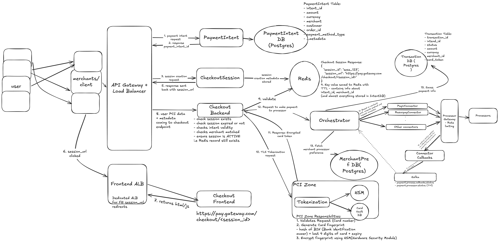

# Payment Gateway (Razorpay/Stripe)

## Important concepts

1. Payment Gateway - acts as traffic controller of payment processors. It's a platform which collects payment from users, secures and tokenises them, orchestrates the transaction flow, and communicates with payment processors
2. Payment Processor - Financial network entity which connects with banks and cards to actually authorize, capture and settle the payment. It is responsible for moving the money
3. PCI-DSS - `Payment Card Industry Data Security Standard` is a global standard for all entities regarding storing/processing/transmitting cardholder data and/or sensitive information

## functional requirements

- client makes payment intent request
- gateway should be able to provide a session page for user to enter payment details
- securing PCI-DSS for card data handling
- once transaction successful, give transaction status back to client
- transaction status tracking

### out of scope

- part payment
- refund

## non functional requirements

- Scale: 10k TPS (transactions per second)
- CAP theorem: Consistency >> avaialbility
- Latency: < 200ms for payment authorization
- PCI-DSS Level 1 compliant

## Core Entity

- Merchants/Clients
- Transaction
- Payment Method
- Customer/User
- WebhookEvent
- PaymentSession

## API Design

- POST /v1/payments/intent
- POST /v1/payments/session
- POST /v1/checkout/pay
- GET /v1/payments/:payment_id

## Deep Dive



### 0. The 30-second pitch

> "A **merchant** (Flipkart, Swiggy...) creates a **PaymentIntent** (amount, currency, order), which is stored in **Postgres**. It then creates a **CheckoutSession**, which lives in **Redis with a TTL**, and gets back a hosted `session_url`. The **user** is redirected to our **Checkout Frontend**, served through a dedicated ALB, and enters their card there, so the merchant never sees card data. The **Checkout Backend** validates the session in Redis and sends the card to the **Tokenization service inside the PCI zone**. That service fingerprints and encrypts the card with an **HSM**, stores it in the **Card Vault**, and returns a token. From this point only the token travels. The **Orchestrator** saves a transaction row, reads the merchant's **processor preference**, and calls the right **connector** (PayU, Razorpay...) through a **rate-limited Processor Gateway**. Processor results come back through **callbacks/webhooks** into **Kafka**, and the Orchestrator updates the transaction status. We choose **consistency over availability**: we would rather fail a payment than charge twice or lose track of a charge."

---

### 1. Flow 1: Create a payment intent (merchant → gateway)

```
Merchant server → API GW + LB → PaymentIntent Service → PaymentIntent DB (Postgres)
                ← payment_intent_id
```

`POST /v1/payments/intent {amount, currency, order_id, customer, payment_method_type, metadata}` → `payment_intent_id` (steps 1–2)

#### PaymentIntent table (Postgres)

`intent_id, amount, currency, merchant_id, customer_id, order_id, payment_method_type, metadata, status, created_at`

- **What is an intent?** It records the merchant's statement "I want to collect ₹X for order Y". It's created **server-to-server** with the merchant's secret API key, so the amount can't be tampered with in the browser.
- **Why Postgres?** Money needs ACID guarantees and strong consistency (CP). The data is relational: intent → transactions → merchant.
- **Idempotency:** the merchant sends an `Idempotency-Key` header. A retry after a timeout returns the same `intent_id` instead of creating a second intent for the same order. A unique constraint on `(merchant_id, order_id)` is a second guard.

---

### 2. Flow 2: Create a checkout session

```
Merchant server → API GW → CheckoutSession Service ──(session metadata, TTL)──→ Redis
                ← { session_id: "sess_123", session_url: "https://pay.gateway.com/checkout/<session_id>" }
```

`POST /v1/payments/session {payment_intent_id}` → `session_id`, `session_url` (steps 3–5)

- The Redis value is keyed by `session_id` and holds `intent_id`, `merchant_id` and most of the intent (amount, currency, allowed methods). The checkout page can then render without a Postgres read.
- **Why Redis with a TTL?** Sessions are short-lived (around 15 minutes) and are read on every page load and on submit. When the TTL expires the session is gone, so an old link can't be reused to pay.
- **Session state:** `ACTIVE → PROCESSING → COMPLETED` (or it expires). This state is how double-submits are blocked in Flow 4.

---

### 3. Flow 3: User opens the hosted checkout page

```
User (browser) ──session_url clicked──→ Frontend ALB ──→ Checkout Frontend
               ←────────── html / js for https://pay.gateway.com/checkout/<session_id>
```

(steps 6–7)

- The merchant redirects the user (or opens an iframe/SDK) to our domain. **Card details are typed into our page, not the merchant's**, which keeps the merchant out of PCI scope. This is what lets a small merchant accept cards without being PCI certified.
- **Why a dedicated Frontend ALB?** Browser traffic for static html/js is kept separate from the merchant-facing API traffic. Each scales and is protected (WAF, bot protection) on its own, and a surge of shoppers can't starve merchant API calls.

---

### 4. Flow 4: User submits the card → validate the session

```
Checkout Frontend → API GW → Checkout Backend ──validate──→ Redis
                   (PCI data + metadata over TLS)
```

(steps 8–9) `POST /v1/checkout/pay {session_id, card_number, expiry, cvv, ...}`

Checkout Backend checks that:

- the session exists (the Redis record is still there, so the TTL hasn't expired)
- the session isn't expired
- the intent is valid (not already paid or cancelled)
- the merchant matches the intent
- the session is `ACTIVE`

_Consideration:_ the raw card passes through the API GW and Checkout Backend, so both are in PCI scope. To shrink scope, the frontend can post the card **directly to the Tokenization service** and send only the token to the Checkout Backend (Stripe Elements works this way).

**Double-click protection:** move `ACTIVE → PROCESSING` atomically (a Lua script or `SET ... NX` on a lock key). A second submit, from a double click or a retry, sees `PROCESSING` and is rejected. Without this, one checkout could charge the card twice.

---

### 5. Flow 5: Tokenization (inside the PCI zone)

```
Checkout Backend ──TLS tokenization request──→ PCI Zone: Tokenization Service ──→ HSM
                                                                       └──→ Card Vault DB
                 ←──────── encrypted card token
```

(steps 10–11)

**PCI zone responsibilities:**

1. **Validate** the card number (Luhn check, valid BIN, expiry not in the past).
2. **Generate a card fingerprint.** The diagram uses a hash of BIN + last 4 digits + expiry. It identifies the same card across payments (saved cards, fraud rules, "this card was used 20 times in 1 minute").
3. **Encrypt** with keys held in the **HSM (Hardware Security Module)**. Keys never leave the HSM, so a stolen DB dump is useless on its own.
4. Store the encrypted card in the **Card Vault DB** and return a **token**.

- **Why the token?** Everything after this step (Orchestrator, Transaction DB, logs) sees only `card_token`. Only the PCI zone is in audit scope, which keeps the most heavily audited part of the system small.
- **CVV is never stored**, not even encrypted (a PCI-DSS rule). It's held in memory only long enough to send the authorization.
- _Consideration:_ BIN + last 4 + expiry can collide between two different cards. A safer fingerprint is a **keyed hash (HMAC) of the full card number**, with the key in the HSM.
- _Consideration:_ the processor needs the real card number. The connector, or the Processor Gateway, must **detokenize inside the PCI zone** right before calling the processor, so those components are in PCI scope too.

---

### 6. Flow 6: Orchestration and routing to a processor

```
Checkout Backend ──request payment (card_token)──→ Orchestrator ──save──→ Transaction DB (Postgres)
                                                       │
                                                       ├──fetch merchant processor preference──→ MerchantPref DB (Postgres)
                                                       │
                                                       └──compute payload──→ PayUConnector / RazorpayConnector / other connectors
                                                                                       │
                                                                                       ▼
                                                                         Processor Gateway (rate limiting) ──→ Processors
```

(steps 12–14)

#### Transaction table (Postgres)

`transaction_id, intent_id, status, amount, currency, merchant_id, card_token, processor, processor_txn_id, created_at, updated_at`

**Status lifecycle:** `INITIATED → PENDING (sent to processor) → SUCCESS | FAILED`. The status only moves forward.

- **Save before calling the processor.** The transaction row is written as `INITIATED` before any money moves. If the Orchestrator crashes mid-call, the row shows that a charge may be in flight, and reconciliation (Flow 7) can find the answer. Calling first and writing afterwards risks a charge with no record.
- **Merchant preference:** each merchant chooses or ranks processors (for example, Razorpay for UPI and PayU for cards, by cost or success rate). The Orchestrator reads that ranking and picks a connector.
- **Connectors (adapter pattern):** each processor has its own API, auth and error codes. A connector translates our standard payload to the processor's format and maps its responses back. Adding a processor means adding a connector, with no change to the Orchestrator.
- **Processor Gateway:** a single egress point to the processors. It enforces per-processor **rate limits**, holds connection pools, and adds a **circuit breaker** per processor.
- **Idempotency towards the processor:** send `transaction_id` as the processor's idempotency key, so a retried call can't create a second charge.
- **Failover:** if the preferred processor is down (circuit open), fall back to the next one in the merchant's ranking. Only do this for a **definite** failure, never for a timeout, because a timed-out call may already have charged the card.
- **Latency (< 200 ms auth):** most of the budget belongs to the processor and bank. Our hops (Redis validation, tokenization, one Postgres insert, a cached merchant preference) must stay in the low tens of ms. Cache MerchantPref in memory or Redis.

---

### 7. Flow 7: Status updates from processors (return path)

```
Processors ──callbacks / webhooks──→ Processor Gateway ──→ Connector Callbacks
                                                                 │
                                                                 ▼ request transaction status update
                                                          Kafka: payment.process.callbacks.status
                                                                 payment.processor.status (T+1)
                                                                 │
                                                                 ▼ (consumed)
                                                           Orchestrator ──update──→ Transaction DB
```

(steps 15–16)

- **Why async?** Many payments don't finish within the request: 3-D Secure/OTP pages, UPI collect requests, bank delays. The processor reports the final result later through a webhook.
- **Connector Callbacks** verifies the webhook's signature, maps the processor's status to ours (each connector has its own mapping), and publishes to Kafka.
- **Two topics:**
  - `payment.process.callbacks.status`: real-time callbacks as they arrive.
  - `payment.processor.status (T+1)`: next-day **settlement/reconciliation** files from processors. These catch any transaction whose callback was lost, or which sat in `PENDING` after a timeout, and settle the final truth.
- **Why Kafka?** It absorbs callback bursts and keeps updates for a transaction ordered (partition key = `transaction_id`). If the Orchestrator is down, nothing is lost; it consumes when it comes back.
- **Idempotent, forward-only updates:** processors resend webhooks. Apply an update only if it moves the status forward (`PENDING → SUCCESS`), and ignore duplicates or late `PENDING` events.

---

### 8. Flow 8: Notify the merchant and track status

_This flow isn't drawn in the diagram. It covers the "give transaction status back to client" requirement and the `WebhookEvent` entity._

```
Orchestrator (status changed) ──→ WebhookEvent table + Kafka ──→ Merchant Webhook Service ──→ merchant's webhook URL
                                                                       └── retry with backoff, then DLQ

User browser ←── redirect to merchant's success/failure URL (Checkout Frontend)

Merchant server → API GW → GET /v1/payments/:payment_id → Transaction DB / PaymentIntent DB
```

- **Webhook to the merchant:** signed (HMAC with the merchant's secret), retried with exponential backoff, and recorded in a `WebhookEvent` table (`event_id, merchant_id, payment_id, type, payload, attempts, status`). The merchant dedupes on `event_id`.
- **Redirect:** the checkout page sends the user back to the merchant's return URL. The merchant must **not** trust the redirect alone. It confirms through the webhook or `GET /v1/payments/:payment_id`.
- **Polling:** `GET /v1/payments/:payment_id` is a fallback for when webhooks are missed. Reads go to the Postgres primary, or to a replica with care, because a stale "PENDING" can make a merchant retry the payment.

---

### 9. Data stores at a glance

| Store              | Tech     | Holds                                         | Why                                                      |
| ------------------ | -------- | --------------------------------------------- | -------------------------------------------------------- |
| PaymentIntent DB   | Postgres | Intents (amount, order, merchant)             | ACID, relational, source of truth for what to collect    |
| Session store      | Redis    | Checkout sessions with TTL                    | Fast reads on every page load and submit, auto-expiry    |
| Card Vault DB      | (PCI zone) | Encrypted card data + fingerprint           | Isolated, encrypted with HSM keys, small audit scope     |
| HSM                | Hardware | Encryption keys                               | Keys never leave the device                              |
| Transaction DB     | Postgres | Every payment attempt + status                | Strong consistency for money, auditable                  |
| MerchantPref DB    | Postgres | Processor ranking per merchant/method         | Small, rarely changing config (cache it)                 |
| Kafka              | Stream   | `payment.process.callbacks.status`, `payment.processor.status` | Buffer callbacks, ordered updates, replay  |

---

### 10. CAP mapping (say this explicitly)

- **The core payment path is CP.** If we can't durably write the transaction or confirm the session lock, we **fail the payment** rather than risk a double charge or a lost record. The user can retry, but a wrong charge is far worse.
- **Where we accept eventual consistency:** the status can sit in `PENDING` until a callback or the T+1 reconciliation arrives, and merchant webhooks are delivered at least once.
- **Scale (10k TPS):** the services are stateless and scale horizontally. Postgres is sharded by `merchant_id` (or `intent_id`). The Redis session store is clustered. The usual ceiling is processor rate limits, which the Processor Gateway enforces.

---

### 11. Quick-fire answers to likely follow-ups

- **"How do you prevent a double charge?"** Three layers: the merchant's idempotency key on intent creation, the atomic `ACTIVE → PROCESSING` session lock on `/checkout/pay`, and `transaction_id` as the idempotency key to the processor.
- **"The processor call timed out. Was the user charged?"** We don't know, so mark the transaction `PENDING`. Don't retry on another processor. Query the processor's status API, wait for the callback, or let the T+1 reconciliation settle it.
- **"Why not let the merchant collect card details?"** The merchant would then be in full PCI-DSS scope. The hosted page plus tokenization keeps raw card data inside our PCI zone only.
- **"What's the HSM for?"** It generates and holds the encryption keys and does encrypt/decrypt inside tamper-resistant hardware. The application never sees the key, so leaked app memory or DB backups don't expose cards.
- **"How do saved cards work?"** Store the `card_token` against the customer. Next time, skip entering the card (and tokenization). The CVV is entered again, or the network token is used.
- **"Why connectors instead of calling processors directly?"** Each processor has its own API and error model. Connectors isolate that, so the Orchestrator stays generic and processors can be added or swapped.
- **"How do you route for the best success rate?"** Extend MerchantPref with live success rate and latency per processor (computed from Kafka callback events), and route dynamically within the merchant's allowed list.
