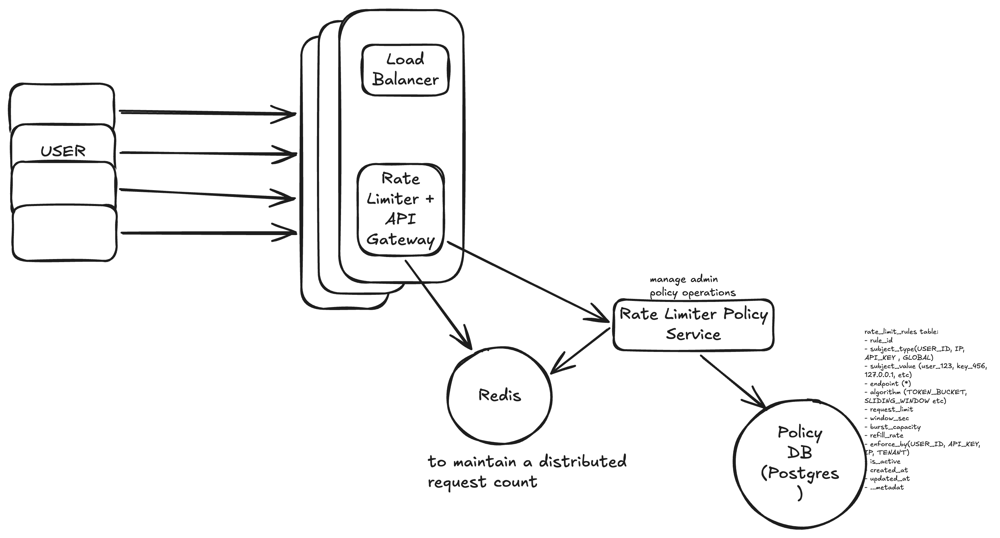

# Design a Rate Limiter

## functional requirements

- Limit number of client requests (userID/ API Key/ IP)
- Rate limits must be configurable at runtime
- When request count exceeds, return 429 to user
- Should be able to handle burst traffic (Eg: flash sale)
- Different rate limit support for different customer tier (Free/Premium)

## non functional requirements

- 1M req/s
- CAP theorem: High available >> high consistency
- Latency: ultra low latency << 5ms

## Core Entity

- Rate Limit Policy/Rules
- Client
- Request Counter

## API Endpoints

- Admin POST /v1/admin/rules (Crete Rules)
- Admin GET /v1/admin/rules?client_id=123
- Admin GET /v1/admin/rate-limit/metrics?resource={url}

**Error Response**

```
HTTP/1.1 429 Too Many Requests
X-RateLimit-Limit: 100
X-RateLimit-Remaining: 0
X-RateLimit-Reset: <reset_timestamp>
Retry-After: 30

{
    "error": "rate_limit_exceeded",
    "message": "You have exceeded 100 requests/min. Retry after 30 seconds"
}
```

## Commonly used algorithms

- Fixed Window
- Sliding Window Log
- Sliding Window Counter
- Token Bucket
- Leaky Bucket


