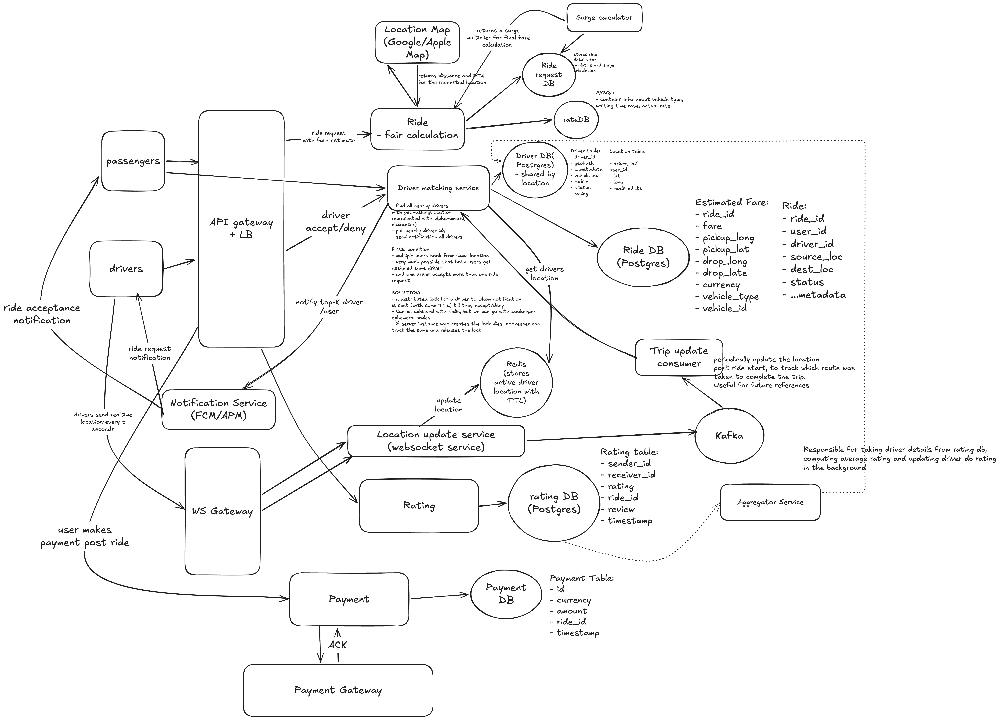

# Ride hailing service like Uber

## functional requirements

- passengers should be able to get a fare estimation
- passengers should be able to request a ride based on the estimate
- passengers should be able to list different types of rides
- drivers should be able to accept/decline a ride request + navigate to pickup location if accepted
- upon ride-request, passenger should be matched with driver who is nearby and available
- real time tracking of drivers and passengers location
- passengers should be able to make payments

## non functional requirements

- scale: millions of users and drivers
- CAP theorem: available for the passenger, consistent for the driver
- latency: less than 1min , driver should get assigned to passenger requesting ride, or else request should fail

## Core Entities

- Passenger
- Driver
- Fare
- Trip/Ride
- Location

## API design

### user/passenger endpoints

- user signup and login
- GET /v1/fare?pickupLat=..&pickupLang=...&dropLat=...&dropLang=... -> List<Fare with request_id>
- POST /v1/rides/request -> payload: {request_id} (request to all nearby drivers): Return ride_id with driver_details(if driver accepts)
- GET /v1/rides/history -> List<Ride> for the user
- GET /v1/rides/:ride_id -> <Ride> details
- POST /v1/rides/:ride_id/cancel -> 204 ok
- POST /v1/rides/:ride_id/ratings

### driver endpoints

- WS: /v1/driver/location -> body: {lat, long} -> updates driver geolocation
- POST /v1/ride -> request_body {request_id, accept/deny} -> driver accepts/denies a ride request
- POST /v1/ride/:ride_id/start
- POST /v1/ride/:ride_id/end

## HLD


## Deep Dive



### 0. The 30-second pitch

> "Passengers get a fare estimate, then request a ride. A **matching service** uses **geohash lookups in Redis** to find nearby drivers and notifies the **top-K** of them one at a time. Each notified driver is held under a **distributed lock with a TTL**, so two passengers can't get the same driver. Drivers stream their location **every 5 seconds over WebSockets**. That stream goes to Redis for live matching and to Kafka for trip history. Payments and ratings are handled by separate services, and ratings are aggregated asynchronously."

---

### 1. Flow 1: Fare estimate

`GET /v1/fare?pickup..&drop..`

```
Passenger → API Gateway + LB → Ride / Fare Calculation Service
   ├─→ Maps API (Google/Apple)  → distance + ETA
   ├─→ rateDB (MySQL)           → per-vehicle-type rates (base, per-km, waiting-time rate)
   ├─→ Surge Calculator         → surge multiplier (reads demand from Ride Request DB)
   └─→ Ride Request DB          → stores the estimate (used later for analytics and surge)
← returns List<Fare> (one per vehicle type), each with a request_id
```

- **Key point:** the estimate is saved with a `request_id`. When the passenger books, they send only that `request_id`, so the client can't tamper with the price.
- **Estimated Fare record:** ride_id, fare, pickup_lat/long, drop_lat/long, currency, vehicle_type, vehicle_id

---

### 2. Flow 2: Driver location updates (always running)

`WS /v1/driver/location {lat, long}`

```
Driver app ──(every ~5s)──→ WS Gateway → Location Update Service
                                          ├─→ Redis   : live location of active drivers (with TTL)
                                          └─→ Kafka   : location event stream
                                                 └─→ Trip Update Consumer → Driver DB (Location table)
                                                     (after the ride starts: records the route taken)
```

- **Why WebSockets?** Millions of drivers each send an update every 5 seconds. Opening a new HTTP connection for every update costs too much. A persistent connection is cheaper and also lets the server push to the driver.
- **Why a TTL in Redis?** If a driver's app dies or goes offline, their key expires on its own. Stale drivers are never matched.
- **Why Kafka?** It keeps the durable route history out of the hot path. Redis serves matching, and Kafka lets the history be written asynchronously.

---

### 3. Flow 3: Ride request and driver matching (the core deep dive)

`POST /v1/rides/request {request_id}`

```
Passenger → API GW → Driver Matching Service
  1. Convert the pickup lat/long into a geohash (for example, "tdr1y")
  2. Query Redis for drivers in that geohash cell + its 8 neighbours
  3. Filter to status = AVAILABLE and the right vehicle type (Driver DB, sharded by location)
  4. Rank them and pick the top-K (by distance/ETA, rating)
  5. For each candidate, one at a time:
        a. ACQUIRE LOCK on driver_id (with a TTL of about 10–15s)
        b. Notification Service (FCM/APNs) → push "ride request" to the driver
        c. Driver replies: POST /v1/ride {request_id, accept|deny}
             ├─ ACCEPT → create a Ride in Ride DB (status = ACCEPTED) → mark driver BUSY
             │           → notify passenger (ride_id + driver details)
             └─ DENY / TTL expires → release the lock → try the next driver
  6. No acceptance within about 1 minute → the request fails (from the non-functional requirements)
```

#### Driver DB (Postgres, sharded by location)

- **Driver table:** driver_id, geohash, vehicle_no, mobile, status, rating, ...metadata
- **Location table:** driver_id/user_id, lat, long, modified_ts

#### Geohashing in one line

A geohash encodes a lat/long as an alphanumeric string. A longer string means a smaller cell, and locations that share a prefix are near each other. Always search the **neighbouring cells** too, because a driver just across a cell boundary may be very close. *(Redis supports this directly: `GEOADD` / `GEOSEARCH`.)*

#### The race condition (a very common interview question)

- **Problem:** two passengers at the same spot request at the same moment. Both matching calls find the same nearby driver and notify them. The driver could end up with two rides, or both passengers could see that driver as assigned.
- **Solution:** use a **distributed lock per driver** while a request is pending.
  - A driver is notified only after the lock is acquired, so one driver has at most one pending request.
  - The lock has a **TTL** so a driver who never responds doesn't block matching forever.
  - **Redis:** `SET driver:{id} request_id NX EX 15` is simple and fast.
  - **ZooKeeper ephemeral nodes** (preferred): if the matching server that holds the lock crashes, its session ends, the node is deleted, and **the lock is released automatically**.

#### CAP mapping (say this explicitly)

- **Driver side needs consistency:** one driver must never get two rides, which is why the lock exists.
- **Passenger side needs availability:** browsing, estimates and tracking should keep working even if the data is slightly stale.

---

### 4. Flow 4: The trip

```
POST /v1/ride/:id/start → Ride DB status = IN_PROGRESS
   Driver keeps streaming location → Kafka → Trip Update Consumer → route saved
   Passenger sees live tracking (driver location pushed over WS)
POST /v1/ride/:id/end   → Ride DB status = COMPLETED → driver back to AVAILABLE
```

- **Ride record:** ride_id, user_id, driver_id, source_loc, dest_loc, status, metadata
- **Status lifecycle:** `REQUESTED → ACCEPTED → IN_PROGRESS → COMPLETED` (or `CANCELLED`)

---

### 5. Flow 5: Payment

```
Passenger → API GW → Payment Service → Payment Gateway (Stripe/Razorpay)
                                     ← ACK (success/failure)
                    → Payment DB {id, ride_id, amount, currency, timestamp}
```

- Use an **idempotency key (such as ride_id)** so a retry never charges twice.
- Payment status should be updated from the gateway's webhook or ACK.

---

### 6. Flow 6: Ratings

```
POST /v1/rides/:id/ratings → Rating Service → Rating DB (Postgres)
     {sender_id, receiver_id, rating, ride_id, review, timestamp}

Aggregator Service (background/batch) → reads Rating DB → computes each driver's average
                                      → updates driver.rating in Driver DB
```

- **Why asynchronous?** Averaging on every read would be expensive, and the rating doesn't need to be exact in real time. It's also used later to rank drivers during matching.

---

### 7. Data stores at a glance

| Store | Tech | Holds | Why |
|---|---|---|---|
| Redis | In-memory | Live driver locations (TTL), geo index | Very frequent writes, fast geo queries |
| Driver DB | Postgres, **sharded by location** | Driver profile, status, rating, location history | Relational data; most queries are local to a region |
| Ride DB | Postgres | Rides and their status | Needs transactions and strong consistency |
| Ride Request DB | — | Fare estimates | Surge calculation and analytics |
| rateDB | MySQL | Rate cards per vehicle type | Small, mostly read |
| Rating DB | Postgres | Individual ratings | Source for aggregation |
| Payment DB | Postgres | Payment records | ACID transactions |
| Kafka | Stream | Location events | Keeps durable writes off the hot path |
| ZooKeeper / Redis | Lock | Driver locks | Prevents double booking |

---

### 8. Quick-fire answers to likely follow-ups

- **"Why not keep locations in Postgres?"** Millions of writes every 5 seconds would overload it. Redis handles the live data, and Kafka feeds the durable history asynchronously.
- **"What if the driver doesn't respond?"** The lock's TTL expires and the next driver in the top-K is tried. The whole request stops at about 1 minute.
- **"What if the matching server crashes mid-request?"** A ZooKeeper ephemeral node is deleted when the server's session ends, so the lock frees itself.
- **"What about hot cells, like an airport or a concert?"** Use a finer geohash precision there, and the surge multiplier reduces demand.
- **"How does the passenger know the driver accepted?"** A push from the Notification Service (FCM/APNs), or the WebSocket if the app is open.
