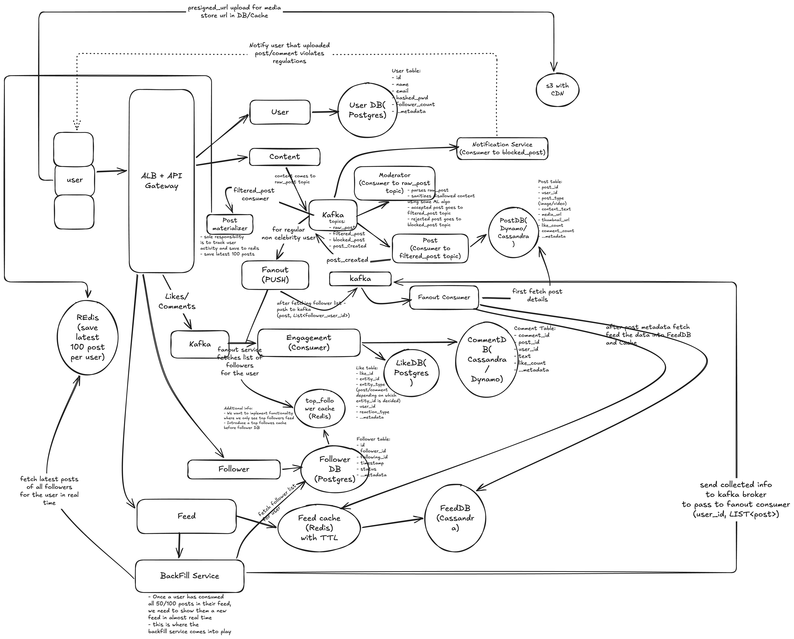

# Design Social Media Platform like facebook/instagram

## functional requirement

- User signup and login
- User should be able to post textually as well as image/video
- Users should be able to follow each other
- User should be able to like/comment on a post
- User should be able to see feed of all users they follow

### out of scope

- user won't be able to add/view story
- user won't be able to upload reel
- user chat application (different problem)
- Post/User analytics
- Image/Video Encoding/Packaging process

## non functional requirements

- Scale: 500M DAU
- CAP Theorem: Highly available (eventually consistent)
- Low Latency: 500ms for upload photo/video post

## Core Entity

- User
- Post
- Feed
- Follow
- Like/Comment

## API Endpoints

1. User Endpoints

- User Signup: POST /v1/users/signup -> {name, email, password (stored as hash)} -> response {user_id, email}
- User Login: POST /v1/users/login -> (email, password) -> response JWT
- Fetch user profile: GET /v1/users/:user_id/profile -> response {User}
- Edit user profile: PUT /v1/users/profile

2. Post Endpoints

- Create new post: POST /v1/posts -> {text, image_urls/video_urls} -> return post_id
- Fetch a particular post: GET /v1/posts/:post_id -> response {Post}
- Edit a particular post: PUT /v1/posts/:post_id -> {...post_body_metadata} -> return {Updated_Post}
- Delete a particular post: DELETE /v1/posts/:post_id -> response HTTP_204
- Fetch feed of a user: GET /v1/feed?limit={limit}&offset={offset} -> Paginated {Feed}
- Fetch posts of a particular user: GET /v1/users/:user_id/posts -> Paginated {Post} Response

3. Engagement/Interaction Endpoints

- Like/Unlike a post: POST /v1/posts/:post_id/like and DELETE /v1/posts/:post_id/like
- Comment on a post: POST /v1/posts/:post_id/comment -> body {comment}
- Fetch comments of a post: GET /v1/posts/:post_id/comments -> Paginated {Comments}
- Edit a comment: PUT /v1/comments/:comment_id
- Delete a comment: DELETE /v1/comments/:comment_id
- User follows: POST /v1/users/:receipient_user_id/follow
- User Unfollow: DELETE /v1/users/:recipient_user_id/follow

## Deep Dive

### Feed Generation

Precompute via fan-out model. 2 types:

- push model: regular user with suppose 1000 followers - anytime a user posts,
  feed update happens for all 1000 followers - acceptable. But won't work for a user with million followers
- pull model: applicable for celebrities with millions of followers - pull on demand i.e data only comes to a
  particular followers feed if requested

### Overall flow in brief

The system has two halves: a **write path**, where content gets in, is moderated, stored and fanned out, and a **read path**, where a precomputed feed is served and refilled when it runs out. The two halves are connected through Kafka.

1. **Media upload:** the client gets a pre-signed URL and uploads images and videos straight to **S3 (served through a CDN)**. Only the URLs go into the post, so no media passes through the services or Kafka.
2. **Post creation:** User → ALB + API Gateway → **Content Service** → Kafka `raw_post` → **Moderator** → `filtered_post` or `blocked_post`.
3. **Accepted post:** the **Post Service** consumes `filtered_post`, saves the post to PostDB, and **then** publishes `post_created`. Because fanout starts from that event, the post is always in PostDB before anything tries to read it.
4. **Fanout (non-celebrity authors):** **Fanout (PUSH)** consumes `post_created`, looks up the author's followers (top_follower cache, then Follower DB), and publishes `(post, List<follower_user_id>)`. The **Fanout Consumer** reads the post from PostDB and writes it into each follower's **Feed cache (Redis, TTL)** and **FeedDB (Cassandra)**.
5. **Rejected post:** the **Notification Service** consumes `blocked_post` and tells the author that the content broke the rules.
6. **Per-author recent posts:** the **Post Materializer** consumes `filtered_post` and keeps the latest 100 moderated posts of every user in Redis. The pull path and the backfill read from here.
7. **Feed read:** User → **Feed Service** → Feed cache, falling back to FeedDB.
8. **Feed exhausted:** once the user has scrolled through the 50–100 precomputed posts, the **Backfill Service** gets the accounts the user follows, takes their latest posts from the per-user Redis, and sends `(user_id, List<post>)` back through Kafka to the Fanout Consumer, which refills that user's feed.
9. **Engagement:** likes and comments → Kafka → **Engagement Consumer** → LikeDB / CommentDB.
10. **Social graph:** follow/unfollow → **Follower Service** → Follower DB, with a `top_follower` Redis cache in front of it.

### What each service does

| Service                  | Talks to                                                     | Responsibility                                                                                                                                                                           |
| ------------------------ | ------------------------------------------------------------ | ---------------------------------------------------------------------------------------------------------------------------------------------------------------------------------------- |
| **ALB + API Gateway**    | All services                                                 | Entry point. Handles routing, JWT validation and rate limiting.                                                                                                                          |
| **User Service**         | User DB (Postgres)                                           | Signup, login (issues JWT), profile CRUD. Stores `follower_count`, which can also be used to tell a celebrity from a regular user.                                                       |
| **Content Service**      | Kafka `raw_post`, S3 (pre-signed URLs)                       | Hands out pre-signed URLs for media and accepts new posts (text + media URLs). Returns right away and leaves the rest to the async pipeline, which keeps upload within the 500ms target. |
| **S3 + CDN**             | Client                                                       | Stores media and serves it to viewers through the CDN. The DB and caches hold only the URLs.                                                                                             |
| **Moderator**            | `raw_post` → `filtered_post` / `blocked_post`                | Parses and sanitises content with an ML model and routes it to the accepted or the blocked topic.                                                                                        |
| **Notification Service** | `blocked_post`                                               | Tells the author that their post or comment was blocked.                                                                                                                                 |
| **Post Service**         | `filtered_post` → PostDB (Dynamo/Cassandra) → `post_created` | Source of truth for posts. Wide-column store because the workload is write-heavy and keyed by `post_id` / `user_id`. Publishes `post_created` only after the write succeeds.             |
| **Post Materializer**    | `filtered_post` → Redis (latest 100 posts per user)          | Keeps a "recent moderated posts by author X" cache. This is the data behind the celebrity pull model and the backfill.                                                                   |
| **Fanout (PUSH)**        | `post_created`, top_follower cache, Follower DB, Kafka       | Runs only for non-celebrity authors. Gets the follower list and publishes one fanout event per post.                                                                                     |
| **Fanout Consumer**      | Kafka, PostDB, Feed cache, FeedDB (Cassandra)                | Reads the post from PostDB and writes it into each target user's feed. Shared by the push fanout and the backfill.                                                                       |
| **Feed Service**         | Feed cache → FeedDB, Backfill                                | Serves the paginated feed. Asks Backfill for more when the precomputed feed runs out.                                                                                                    |
| **Backfill Service**     | Follower DB, per-user Redis, Kafka                           | Builds a new feed on demand from the latest posts of the accounts the user follows.                                                                                                      |
| **Engagement Consumer**  | Kafka → LikeDB (Postgres), CommentDB (Cassandra/Dynamo)      | Saves likes and comments. LikeDB is polymorphic through `entity_type`, so the same table covers likes on posts and on comments.                                                          |
| **Follower Service**     | Follower DB (Postgres), top_follower cache                   | Follow and unfollow. The cache holds the "top" accounts so the feed can be limited to them.                                                                                              |

### Review comments / gaps worth addressing

**Correctness and design gaps**

1. **The celebrity pull path isn't drawn.** Fanout is labelled "for regular non celebrity user", but the diagram doesn't show where celebrity posts get merged in. At read time, the Feed Service should (a) read the pushed feed, (b) find the celebrities the user follows, (c) take their latest posts from the per-user Redis, and (d) merge them by timestamp or rank. The celebrity threshold also needs a definition, e.g. `follower_count > 100k`.
2. **Store `post_id`s in the feed, not full posts.** The Fanout Consumer copies post details into the feed, so edits, deletes and like/comment counts go stale in millions of feeds. In FeedDB (Cassandra), store `(user_id, created_at DESC, post_id)` with `user_id` as the partition key, cap the entries kept per user, and look the posts up in PostDB or a post cache when the feed is read. This also makes `DELETE /posts/:id` work without a reverse fanout.
3. **Comments skip moderation.** The Notification Service says "post/comment violates regulations", but comments go Kafka → Engagement and never reach the Moderator. Send comments through the same moderation topics.
4. **Follower direction is mixed up in the Backfill notes.** "Fetch latest posts of all followers" and "fetch follower list for user" should both say **followees**, the accounts the user follows. Fanout needs `followers(author)`, while backfill and pull need `following(user)`. Index Follower DB both ways, or keep two edge tables, so either query hits a single shard.
5. **Uploads that are never used.** With pre-signed URLs, a client can upload media and then never create the post, or the post can get blocked. Add an S3 lifecycle rule to delete files that aren't linked to a post after N hours. Run media through moderation too (by reading it from S3), not just the text.

**Scale considerations (500M DAU)**

6. **Hot counters.** `like_count`, `comment_count` and `follower_count` on a celebrity post or profile become hot rows. Count in Redis (`INCR`) and flush to the DB in batches, or aggregate per minute from the engagement stream.
7. **Like idempotency.** Put a unique constraint on `(user_id, entity_id, entity_type)` so retries and double-taps don't double count. Unlike should delete that row. Postgres for LikeDB at this scale needs sharding by `entity_id`. Cassandra is an alternative.
8. **Skip fanout to inactive users.** Pushing to users who haven't logged in for N days wastes writes. Backfill already exists and can build their feed when they log in.
9. **Use cursor pagination for the feed.** With `limit/offset` on a feed that keeps changing, posts get duplicated or skipped as new ones arrive. Use `GET /v1/feed?cursor=<last_post_ts_or_id>&limit=20`.
10. **Read-your-own-write.** Moderation is asynchronous, so authors won't see their own post in the feed right away. Insert it into the author's own feed (or show it optimistically on the client) with status `PROCESSING`.

**Open points / clarifications**

- **What "top followers" means needs pinning down:** the top N accounts the user interacts with most, or a ranking? Either way, a ranking signal is needed. The feed is currently chronological, and ranking is neither drawn nor listed as out of scope.
- **Name the Kafka topics on the second broker**, e.g. `post_fanout`, `feed_backfill`, `engagement_events`.
- The Notification Service only covers blocked posts. Notifications for likes, comments and follows are a natural extension. List them under out of scope if they're not intended.

**Nits in the README**

- The "500ms for upload" target should say what it measures: the API acknowledging the post, not the post being moderated and fanned out.
- Add a step before `POST /v1/posts` for getting a pre-signed URL, e.g. `POST /v1/media/upload-url -> {upload_url, media_url}`.
