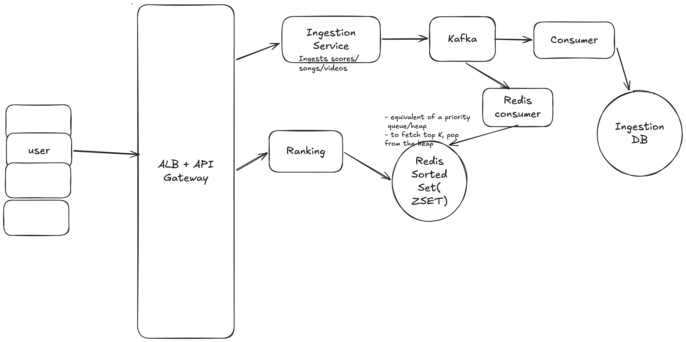
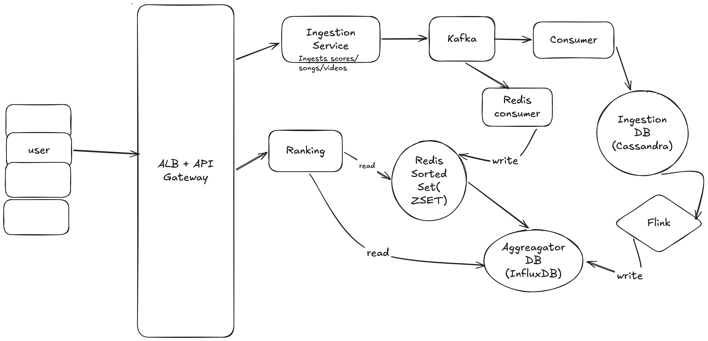

# Design Leaderboard / Top K / Trending List

Possible use cases:

- A real time dashboard to track top players, ranks and scores across several games, regions, and time windows, with instant updates
- Trending artists/songs on Spotify

## functional requirements

- user should be insert/update/delete data into our list (video/song/leaderboard)(dynamic list)
- user should be able to query the top K trending songs/videos/score based on regions/groups
- time periods for querying to be limited to hours/days/weeks or all-time
- for leaderboard, user should be able to get realtime updates

## non functional requirements

- scale: 1M req/sec (for data insertion), billions of songs/videos/players
- CAP theorem: highly available >> highly consistent
- latency: 100ms (to fetch topK list) and 500ms (to insert/update data)
- accurate result (not probabilistic result)

## Core Entites

- Score/View/Like
- Player/Video/Song
- Timeframe (day/hour/week/month)

## API Design

- POST /v1/scores (to insert data - score/view/like)
- WS/GET /leaderboard/:id/top?window={daily/monthly}&region=IN&limit=K (1 - 10k) -> Paginated response
- GET /leaderboard/:id/rank/:user_id?window=weekly&limit=5 - fetch rank for a particular player in a particular timeframe

## Deep Dive

We will provide multiple solutions:

### Solution 1

- We need to implement a functionality like a heap/priority queue to insert data, so that the data gets sorted naturally basis of a certain parameter, whenever a write happens
- On needing to access the top-K elements from the heap, we simply pop the top K elements from the heap
- In a real world system, this can be achieved via Redis Sorted Setd (ZSET)
- The kafka broker which ingests the incoming score/video/song has 2 consumers:
  - one for ingestion to the IngestionDB
  - second for putting into the Redis Sorted Set (Example key: `leaderboard:<music/video/score>:<region>:all_time`)
- The ranking service fetches from the Sorted Set

**CONS**:

- This Redis Sorted set is a single point of failure
- There is no time-frame associated timeframe on the stored data in the sorted set, so fetching data like last 90 days would be difficult and high latency

### Potential solution to above problem

A simple solution is to store multiple keys divided by time: Like `leaderboard:<music/video/score>:<region>:30D`, `leaderboard:<music/video/score>:<region>:60D`, `leaderboard:<music/video/score>:<region>:90D` - this allows a very low latency response
**CONS:** Applicable only for multi region suppor - per region data storage means billions of records, which again becomes a problem

**Solution:** For scalability, we can create a Redis cluster having mulitple sorted sets, each sharded by region, with periodic snapshots to DB

## Solution 2

- Instead of using Redis, anytime data comes to Ingestion DB (Cassandra), a background worker/CRON job like Apache flink(for batch computations) can be used, which pre-computes the feed and stores it into an `Aggregator DB`
- The Ranking Service accesses this `Aggregator DB` and can access multiple timeframes of data and data is also continuously being updated, so a good DB choice for this `Aggregator DB` is a `Time Series DB like InfluxDB`
- Can introduce a caching layer to access pre-computed layer

**CONS**: The only downside is that because of Flink processing, the computation of the top-K item is not truly real time. Which is fine for a requirement where real-time updates maynot be necessary

## Solution 3

Hybrid solution: Combine both, have latest data on Redis Sorted Set, and past precomputed data on aggregator DB

